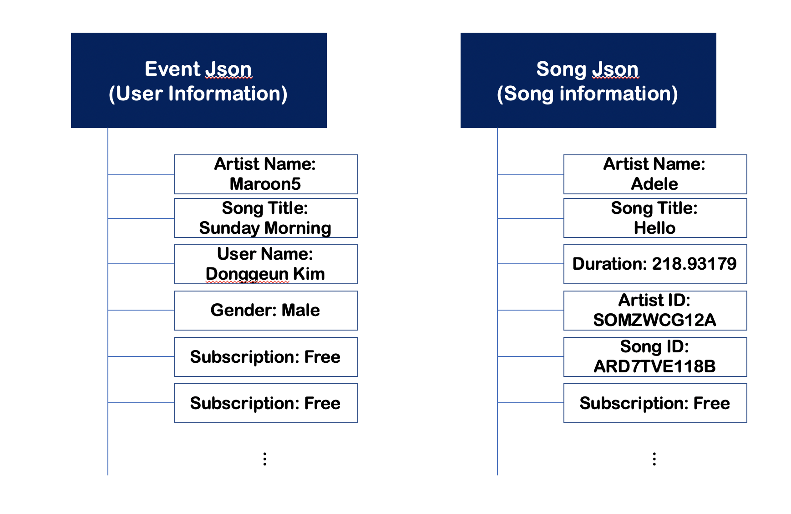
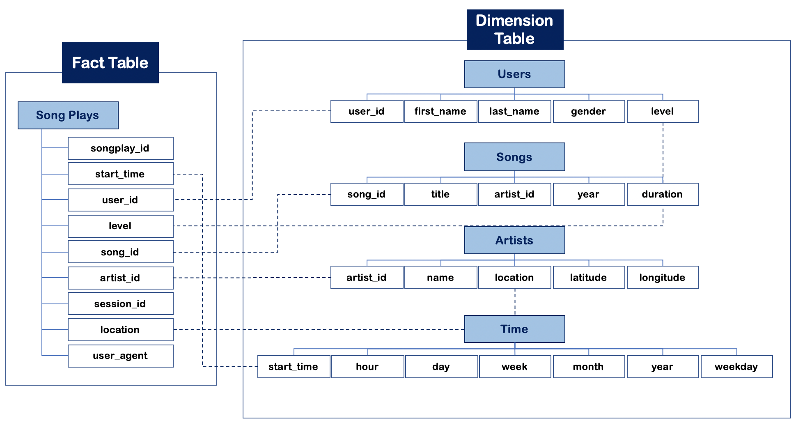

<!DOCTYPE html>
<html>
<head>
<meta name="viewport" content="width=device-width, initial-scale=1">

</head>
<body>

<h2>Schema for Song Play Analysis</h2>
    

        This project builds on top of the SQL ETL project. Run `create_tables.py` and then `etl.py`. The primary difference is that this project loads data from Amazon S3 and Fact/Dimension table in Amazon Redshift Cluster.
        Using the song and user datasets, this project attempts to create a star schema optimized for queries on song play analysis. 
        The data feeds are as following.
    

</body>
</html>

<!DOCTYPE html>
<html>
<head>
<meta name="viewport" content="width=device-width, initial-scale=1">

</head>
<body>

<h4>Schema Illustration</h4>

    The schema organizes data above into following set of tables. The fact table supports general analysis of data feed whereas dimension tables highlight distinctive features worthy of attentions on their own.

</body>
</html>

##### Core files or, in other words, final output consists of following.
##### 1. `create_tables.py`
This file initializes database for this project, drops table if there is any, and creates tables discussed above.
##### 2. `sql_queries.py`
It is a collection of sql queries necessary for dropping and creating tables. It also contains queries for inserting data into each table, which is utilized in `etl.py`
##### 3. `etl.py`
It grabs relevant files, processes files and feeds relevant data to tables.
##### 4. `dwh.cfg`
It aggregates data ware house information. It also contains sensitive information that must not be share

