# Implementation Exercise: Work in Progress
### _Return Predictability and Dynamic Asset Allocation: How Often Should Investors Rebalance?_
by _Himanshu Almadi, David E. Rapach, and Anil Suri_

## 1. Processing data from Bloomberg Terminal


```python
import pandas as pd
import numpy as np
import matplotlib.pyplot as plt
import multiprocessing
from cvxopt import matrix, solvers
from gurobipy import *
```


```python
def process_xlsx(filename,filetype = 'Bloomberg'):
    """
    process .xlsx files downloaded from Bloomberg and Factset
    """
    file = './data/' + filename
    if filetype == 'Bloomberg':
        df = pd.read_excel(file,header=5)
        df.rename(columns = {'Unnamed: 0':'dates'},inplace=True)
        df.loc[:,'Dates']=pd.to_datetime(df['Dates'])
    if filetype == 'Bonds':
        df = pd.read_excel(file,header=3,parser='Date')
    if filetype == 'Bills':
        df = pd.read_excel(file,header=20,parser='Date')
    return df.reset_index(drop=True)
```


```python
other_df = process_xlsx('others.xlsx')
other_df.head()
```


<div>
<style scoped>
    .dataframe tbody tr th:only-of-type {
        vertical-align: middle;
    }

    .dataframe tbody tr th {
        vertical-align: top;
    }

    .dataframe thead th {
        text-align: right;
    }
</style>
<table border="1" class="dataframe">
  <thead>
    <tr style="text-align: right;">
      <th></th>
      <th>Dates</th>
      <th>SPX Index</th>
      <th>SPXDIV Index</th>
      <th>CPI INDX Index</th>
      <th>CT10 Govt</th>
      <th>CB3 Govt</th>
      <th>MOODCBAA Index</th>
      <th>MOODCAAA Index</th>
      <th>IP Index</th>
    </tr>
  </thead>
  <tbody>
    <tr>
      <th>0</th>
      <td>NaT</td>
      <td>329.08</td>
      <td>NaN</td>
      <td>NaN</td>
      <td>NaN</td>
      <td>NaN</td>
      <td>NaN</td>
      <td>NaN</td>
      <td>NaN</td>
    </tr>
    <tr>
      <th>1</th>
      <td>1990-02-28</td>
      <td>331.89</td>
      <td>NaN</td>
      <td>128.0</td>
      <td>NaN</td>
      <td>NaN</td>
      <td>10.14</td>
      <td>9.22</td>
      <td>64.0446</td>
    </tr>
    <tr>
      <th>2</th>
      <td>1990-03-30</td>
      <td>339.94</td>
      <td>0.31</td>
      <td>128.6</td>
      <td>NaN</td>
      <td>NaN</td>
      <td>10.21</td>
      <td>9.37</td>
      <td>64.3580</td>
    </tr>
    <tr>
      <th>3</th>
      <td>1990-04-30</td>
      <td>330.80</td>
      <td>0.98</td>
      <td>128.9</td>
      <td>NaN</td>
      <td>NaN</td>
      <td>10.30</td>
      <td>9.46</td>
      <td>64.2602</td>
    </tr>
    <tr>
      <th>4</th>
      <td>1990-05-31</td>
      <td>361.23</td>
      <td>2.74</td>
      <td>129.1</td>
      <td>NaN</td>
      <td>NaN</td>
      <td>10.41</td>
      <td>9.47</td>
      <td>64.3973</td>
    </tr>
  </tbody>
</table>
</div>


```python
df_bonds = process_xlsx('./facset/US10YY-TU1.xlsx','Bonds')
df_bonds.head()
```


<div>
<style scoped>
    .dataframe tbody tr th:only-of-type {
        vertical-align: middle;
    }

    .dataframe tbody tr th {
        vertical-align: top;
    }

    .dataframe thead th {
        text-align: right;
    }
</style>
<table border="1" class="dataframe">
  <thead>
    <tr style="text-align: right;">
      <th></th>
      <th>Date</th>
      <th>Close</th>
      <th>Volume</th>
      <th>Change</th>
      <th>% Change</th>
      <th>Total Return (Gross)</th>
      <th>Cumulative Return %</th>
      <th>Open</th>
      <th>High</th>
      <th>Low</th>
    </tr>
  </thead>
  <tbody>
    <tr>
      <th>0</th>
      <td>1990-01-31</td>
      <td>8.43</td>
      <td>NaN</td>
      <td>NaN</td>
      <td>NaN</td>
      <td>8.43</td>
      <td>0.000000</td>
      <td>NaN</td>
      <td>NaN</td>
      <td>NaN</td>
    </tr>
    <tr>
      <th>1</th>
      <td>1990-02-28</td>
      <td>8.51</td>
      <td>NaN</td>
      <td>0.080000</td>
      <td>0.948991</td>
      <td>8.51</td>
      <td>0.948992</td>
      <td>NaN</td>
      <td>NaN</td>
      <td>NaN</td>
    </tr>
    <tr>
      <th>2</th>
      <td>1990-03-30</td>
      <td>8.65</td>
      <td>NaN</td>
      <td>0.139999</td>
      <td>1.645116</td>
      <td>8.65</td>
      <td>2.609727</td>
      <td>NaN</td>
      <td>NaN</td>
      <td>NaN</td>
    </tr>
    <tr>
      <th>3</th>
      <td>1990-04-30</td>
      <td>9.04</td>
      <td>NaN</td>
      <td>0.390000</td>
      <td>4.508675</td>
      <td>9.04</td>
      <td>7.236062</td>
      <td>NaN</td>
      <td>NaN</td>
      <td>NaN</td>
    </tr>
    <tr>
      <th>4</th>
      <td>1990-05-31</td>
      <td>8.60</td>
      <td>NaN</td>
      <td>-0.440000</td>
      <td>-4.867252</td>
      <td>8.60</td>
      <td>2.016607</td>
      <td>NaN</td>
      <td>NaN</td>
      <td>NaN</td>
    </tr>
  </tbody>
</table>
</div>


```python
df_bill = process_xlsx('./facset/TRYUS3M-FDS.xlsx','Bills')
df_bill.head()
```


<div>
<style scoped>
    .dataframe tbody tr th:only-of-type {
        vertical-align: middle;
    }

    .dataframe tbody tr th {
        vertical-align: top;
    }

    .dataframe thead th {
        text-align: right;
    }
</style>
<table border="1" class="dataframe">
  <thead>
    <tr style="text-align: right;">
      <th></th>
      <th>Date</th>
      <th>Close</th>
      <th>Volume</th>
      <th>Change</th>
      <th>% Change</th>
      <th>Total Return (Gross)</th>
      <th>Cumulative Return %</th>
      <th>Open</th>
      <th>High</th>
      <th>Low</th>
    </tr>
  </thead>
  <tbody>
    <tr>
      <th>0</th>
      <td>1990-01-31</td>
      <td>7.74</td>
      <td>NaN</td>
      <td>NaN</td>
      <td>NaN</td>
      <td>7.74</td>
      <td>0.000000</td>
      <td>NaN</td>
      <td>NaN</td>
      <td>NaN</td>
    </tr>
    <tr>
      <th>1</th>
      <td>1990-02-28</td>
      <td>7.77</td>
      <td>NaN</td>
      <td>0.03</td>
      <td>0.387600</td>
      <td>7.77</td>
      <td>0.387597</td>
      <td>NaN</td>
      <td>NaN</td>
      <td>NaN</td>
    </tr>
    <tr>
      <th>2</th>
      <td>1990-03-30</td>
      <td>7.80</td>
      <td>NaN</td>
      <td>0.03</td>
      <td>0.386103</td>
      <td>7.80</td>
      <td>0.775194</td>
      <td>NaN</td>
      <td>NaN</td>
      <td>NaN</td>
    </tr>
    <tr>
      <th>3</th>
      <td>1990-04-30</td>
      <td>7.79</td>
      <td>NaN</td>
      <td>-0.01</td>
      <td>-0.128208</td>
      <td>7.79</td>
      <td>0.645995</td>
      <td>NaN</td>
      <td>NaN</td>
      <td>NaN</td>
    </tr>
    <tr>
      <th>4</th>
      <td>1990-05-31</td>
      <td>7.75</td>
      <td>NaN</td>
      <td>-0.04</td>
      <td>-0.513478</td>
      <td>7.75</td>
      <td>0.129199</td>
      <td>NaN</td>
      <td>NaN</td>
      <td>NaN</td>
    </tr>
  </tbody>
</table>
</div>


## 2. Processing Explanatory Variables

### 2.1 log(D/P)

More specifically, I am computing the following:
$$ log(\sum_{s=1}^{12} D_{t-(s-1)}) - log(P_{t}) $$
where `D` stands for dividens paid by `SP500` constituents at time t. 
And `P` stands for `SP500` at time t.


As a sanity check, I wanted to check there are only two `NaN` values for `SPXDIV Index`


```python
other_df['SPXDIV Index'].isna().sum()
```


    2


```python
other_df.head()
```


<div>
<style scoped>
    .dataframe tbody tr th:only-of-type {
        vertical-align: middle;
    }

    .dataframe tbody tr th {
        vertical-align: top;
    }

    .dataframe thead th {
        text-align: right;
    }
</style>
<table border="1" class="dataframe">
  <thead>
    <tr style="text-align: right;">
      <th></th>
      <th>Dates</th>
      <th>SPX Index</th>
      <th>SPXDIV Index</th>
      <th>CPI INDX Index</th>
      <th>CT10 Govt</th>
      <th>CB3 Govt</th>
      <th>MOODCBAA Index</th>
      <th>MOODCAAA Index</th>
      <th>IP Index</th>
    </tr>
  </thead>
  <tbody>
    <tr>
      <th>0</th>
      <td>NaT</td>
      <td>329.08</td>
      <td>NaN</td>
      <td>NaN</td>
      <td>NaN</td>
      <td>NaN</td>
      <td>NaN</td>
      <td>NaN</td>
      <td>NaN</td>
    </tr>
    <tr>
      <th>1</th>
      <td>1990-02-28</td>
      <td>331.89</td>
      <td>NaN</td>
      <td>128.0</td>
      <td>NaN</td>
      <td>NaN</td>
      <td>10.14</td>
      <td>9.22</td>
      <td>64.0446</td>
    </tr>
    <tr>
      <th>2</th>
      <td>1990-03-30</td>
      <td>339.94</td>
      <td>0.31</td>
      <td>128.6</td>
      <td>NaN</td>
      <td>NaN</td>
      <td>10.21</td>
      <td>9.37</td>
      <td>64.3580</td>
    </tr>
    <tr>
      <th>3</th>
      <td>1990-04-30</td>
      <td>330.80</td>
      <td>0.98</td>
      <td>128.9</td>
      <td>NaN</td>
      <td>NaN</td>
      <td>10.30</td>
      <td>9.46</td>
      <td>64.2602</td>
    </tr>
    <tr>
      <th>4</th>
      <td>1990-05-31</td>
      <td>361.23</td>
      <td>2.74</td>
      <td>129.1</td>
      <td>NaN</td>
      <td>NaN</td>
      <td>10.41</td>
      <td>9.47</td>
      <td>64.3973</td>
    </tr>
  </tbody>
</table>
</div>


```python
df = pd.DataFrame([])
df['Dates'] = other_df['Dates']
df['log_DP'] = (other_df['SPXDIV Index'].rolling(12).sum().apply('log').shift()
                - other_df['SPX Index'].apply('log'))
```


```python
df[['Dates','log_DP']][13:].head()
```


<div>
<style scoped>
    .dataframe tbody tr th:only-of-type {
        vertical-align: middle;
    }

    .dataframe tbody tr th {
        vertical-align: top;
    }

    .dataframe thead th {
        text-align: right;
    }
</style>
<table border="1" class="dataframe">
  <thead>
    <tr style="text-align: right;">
      <th></th>
      <th>Dates</th>
      <th>log_DP</th>
    </tr>
  </thead>
  <tbody>
    <tr>
      <th>13</th>
      <td>1991-02-28</td>
      <td>NaN</td>
    </tr>
    <tr>
      <th>14</th>
      <td>1991-03-29</td>
      <td>-3.184739</td>
    </tr>
    <tr>
      <th>15</th>
      <td>1991-04-30</td>
      <td>-3.187664</td>
    </tr>
    <tr>
      <th>16</th>
      <td>1991-05-31</td>
      <td>-3.221650</td>
    </tr>
    <tr>
      <th>17</th>
      <td>1991-06-28</td>
      <td>-3.175793</td>
    </tr>
  </tbody>
</table>
</div>


Compare 14th row with following for sanity check:


```python
np.log(sum(other_df['SPXDIV Index'][2:14])) - np.log(other_df['SPX Index'][14])
```


    -3.1847388834548687


### 2.2 Inflation

Inflation is calculated by CPI Index. The research paper writes following: 
<br>
_We account for the delay in the release of monthly CPI data when computing the forecast_
<br>
My susequent search suggested that  CPI Index is released with lag of 1 month.
<br>
Thus, I adjust for the issue by shifting CPI Index level by 1.
$$ inflation_{t} = \frac{CPI_{t}}{CPI_{t-1}}$$
However, at time t, the most recent available inflation rate is that of time t-1.


```python
df['inflation'] = other_df['CPI INDX Index'].pct_change().shift()
```


```python
df[['Dates','inflation']].head()
```


<div>
<style scoped>
    .dataframe tbody tr th:only-of-type {
        vertical-align: middle;
    }

    .dataframe tbody tr th {
        vertical-align: top;
    }

    .dataframe thead th {
        text-align: right;
    }
</style>
<table border="1" class="dataframe">
  <thead>
    <tr style="text-align: right;">
      <th></th>
      <th>Dates</th>
      <th>inflation</th>
    </tr>
  </thead>
  <tbody>
    <tr>
      <th>0</th>
      <td>NaT</td>
      <td>NaN</td>
    </tr>
    <tr>
      <th>1</th>
      <td>1990-02-28</td>
      <td>NaN</td>
    </tr>
    <tr>
      <th>2</th>
      <td>1990-03-30</td>
      <td>NaN</td>
    </tr>
    <tr>
      <th>3</th>
      <td>1990-04-30</td>
      <td>0.004687</td>
    </tr>
    <tr>
      <th>4</th>
      <td>1990-05-31</td>
      <td>0.002333</td>
    </tr>
  </tbody>
</table>
</div>


Following is a sanity check. inflation rate for 2nd row is consistent with third row of inflation columns. The rationale for this is explained at the Markdown Cell above


```python
(other_df['CPI INDX Index'][2]/other_df['CPI INDX Index'][1] -1)
```


    0.004687499999999956


### 2.3 Term Spread

Term spread refers to the difference between 10-year Treasury bond yield and the three-month Treasury bill yield.


```python
df['Term_Spread'] = df_bonds['Close'] - df_bill['Close']
```


```python
df[['Dates','Term_Spread']].head()
```


<div>
<style scoped>
    .dataframe tbody tr th:only-of-type {
        vertical-align: middle;
    }

    .dataframe tbody tr th {
        vertical-align: top;
    }

    .dataframe thead th {
        text-align: right;
    }
</style>
<table border="1" class="dataframe">
  <thead>
    <tr style="text-align: right;">
      <th></th>
      <th>Dates</th>
      <th>Term_Spread</th>
    </tr>
  </thead>
  <tbody>
    <tr>
      <th>0</th>
      <td>NaT</td>
      <td>0.690001</td>
    </tr>
    <tr>
      <th>1</th>
      <td>1990-02-28</td>
      <td>0.740000</td>
    </tr>
    <tr>
      <th>2</th>
      <td>1990-03-30</td>
      <td>0.849999</td>
    </tr>
    <tr>
      <th>3</th>
      <td>1990-04-30</td>
      <td>1.250000</td>
    </tr>
    <tr>
      <th>4</th>
      <td>1990-05-31</td>
      <td>0.850000</td>
    </tr>
  </tbody>
</table>
</div>


### 2.4 Default Spread

The difference between Moody's BAA and AAA rated corporate Bond yields


```python
df['Default_Spread']=other_df['MOODCBAA Index'] - other_df['MOODCAAA Index']
```


```python
df[['Dates','Default_Spread']].head()
```


<div>
<style scoped>
    .dataframe tbody tr th:only-of-type {
        vertical-align: middle;
    }

    .dataframe tbody tr th {
        vertical-align: top;
    }

    .dataframe thead th {
        text-align: right;
    }
</style>
<table border="1" class="dataframe">
  <thead>
    <tr style="text-align: right;">
      <th></th>
      <th>Dates</th>
      <th>Default_Spread</th>
    </tr>
  </thead>
  <tbody>
    <tr>
      <th>0</th>
      <td>NaT</td>
      <td>NaN</td>
    </tr>
    <tr>
      <th>1</th>
      <td>1990-02-28</td>
      <td>0.92</td>
    </tr>
    <tr>
      <th>2</th>
      <td>1990-03-30</td>
      <td>0.84</td>
    </tr>
    <tr>
      <th>3</th>
      <td>1990-04-30</td>
      <td>0.84</td>
    </tr>
    <tr>
      <th>4</th>
      <td>1990-05-31</td>
      <td>0.94</td>
    </tr>
  </tbody>
</table>
</div>


As with `term spread`, a few observation would be sufficient for a sanity check as it only requires a subtraction


```python
other_df[['Dates','MOODCBAA Index','MOODCAAA Index']].head()
```


<div>
<style scoped>
    .dataframe tbody tr th:only-of-type {
        vertical-align: middle;
    }

    .dataframe tbody tr th {
        vertical-align: top;
    }

    .dataframe thead th {
        text-align: right;
    }
</style>
<table border="1" class="dataframe">
  <thead>
    <tr style="text-align: right;">
      <th></th>
      <th>Dates</th>
      <th>MOODCBAA Index</th>
      <th>MOODCAAA Index</th>
    </tr>
  </thead>
  <tbody>
    <tr>
      <th>0</th>
      <td>NaT</td>
      <td>NaN</td>
      <td>NaN</td>
    </tr>
    <tr>
      <th>1</th>
      <td>1990-02-28</td>
      <td>10.14</td>
      <td>9.22</td>
    </tr>
    <tr>
      <th>2</th>
      <td>1990-03-30</td>
      <td>10.21</td>
      <td>9.37</td>
    </tr>
    <tr>
      <th>3</th>
      <td>1990-04-30</td>
      <td>10.30</td>
      <td>9.46</td>
    </tr>
    <tr>
      <th>4</th>
      <td>1990-05-31</td>
      <td>10.41</td>
      <td>9.47</td>
    </tr>
  </tbody>
</table>
</div>


### 2.5  Moving Averages

Average of `SPX Index` for the past 12-months.
<br>
$$ MA_{t} = \frac{\sum_{i=0}^{11} SPX_{t-i}}{12}$$


```python
Moving_Average_12 = other_df['SPX Index'].rolling(12).mean()
```


```python
Moving_Average_12[10:].head()
```


    10           NaN
    11    332.680000
    12    333.917500
    13    336.849167
    14    339.789167
    Name: SPX Index, dtype: float64


As a sanity check: the moving average of first 12 numbers are as following:


```python
np.mean(other_df['SPX Index'][:12])
```


    332.68000000000006


```python
Moving_Average_2 = other_df['SPX Index'].rolling(2).mean()
```


```python
Moving_Average_2.head()
```


    0        NaN
    1    330.485
    2    335.915
    3    335.370
    4    346.015
    Name: SPX Index, dtype: float64


As a sanity check: the moving average of first 12 numbers are as following:


```python
np.mean(other_df['SPX Index'][:2])
```


    330.485


```python
Bond_Moving_Average_12 = df_bonds['Close'].rolling(12).mean()
```


```python
Bond_Moving_Average_12[10:].head()
```


    10         NaN
    11    8.557500
    12    8.524167
    13    8.483333
    14    8.433333
    Name: Close, dtype: float64


As a sanity check: the moving average of first 12 numbers are as following:


```python
df_bonds['Close'][:12].mean()
```


    8.557499965031942


```python
Bond_Moving_Average_6 = Bond_Moving_Average_12 = df_bonds['Close'].rolling(6).mean()
```


```python
Bond_Moving_Average_6[5:].head()
```


    5    8.610000
    6    8.598333
    7    8.656667
    8    8.685000
    9    8.620000
    Name: Close, dtype: float64


```python
np.mean(df_bonds['Close'][:6])
```


    8.610000133514404


### 2.5.1 MA(1,12) 

It is a dummy variable based on `SPX Index` level and `Moving_Average_12`
<br>
If `SPX Index` value is greater than its 12 months moving average, then assign 1. Otherwise assign 0.


```python
MA_nan = (other_df['SPX Index']-Moving_Average_12).apply(lambda x: np.nan if np.isnan(x) else 0)
```


```python
df['MA_1_12']=(other_df['SPX Index']-Moving_Average_12).apply(lambda x: 1 if x>0 else 0) + MA_nan
```


```python
df[['Dates','MA_1_12']][9:].head()
```


<div>
<style scoped>
    .dataframe tbody tr th:only-of-type {
        vertical-align: middle;
    }

    .dataframe tbody tr th {
        vertical-align: top;
    }

    .dataframe thead th {
        text-align: right;
    }
</style>
<table border="1" class="dataframe">
  <thead>
    <tr style="text-align: right;">
      <th></th>
      <th>Dates</th>
      <th>MA_1_12</th>
    </tr>
  </thead>
  <tbody>
    <tr>
      <th>9</th>
      <td>1990-10-31</td>
      <td>NaN</td>
    </tr>
    <tr>
      <th>10</th>
      <td>1990-11-30</td>
      <td>NaN</td>
    </tr>
    <tr>
      <th>11</th>
      <td>1990-12-31</td>
      <td>0.0</td>
    </tr>
    <tr>
      <th>12</th>
      <td>1991-01-31</td>
      <td>1.0</td>
    </tr>
    <tr>
      <th>13</th>
      <td>1991-02-28</td>
      <td>1.0</td>
    </tr>
  </tbody>
</table>
</div>


As a sanity check, since Moving_Average_12 is already checked, following shows that lambda function performs as expected.


```python
(other_df['SPX Index']-Moving_Average_12)[9:].head()
```


    9           NaN
    10          NaN
    11    -2.460000
    12    10.012500
    13    30.220833
    Name: SPX Index, dtype: float64


### 2.5.2 MA(2,12) 

It is a dummy variable based on `Moving_Average_2`  and `Moving_Average_12`
<br>
If `Moving_Average_2` value is greater than `Moving_Average_12` value, then assign 1. Otherwise assign 0.


```python
df['MA_2_12']=(Moving_Average_2-Moving_Average_12).apply(lambda x: 1 if x>0 else 0) + MA_nan
```


```python
df[['Dates','MA_2_12']][9:].head()
```


<div>
<style scoped>
    .dataframe tbody tr th:only-of-type {
        vertical-align: middle;
    }

    .dataframe tbody tr th {
        vertical-align: top;
    }

    .dataframe thead th {
        text-align: right;
    }
</style>
<table border="1" class="dataframe">
  <thead>
    <tr style="text-align: right;">
      <th></th>
      <th>Dates</th>
      <th>MA_2_12</th>
    </tr>
  </thead>
  <tbody>
    <tr>
      <th>9</th>
      <td>1990-10-31</td>
      <td>NaN</td>
    </tr>
    <tr>
      <th>10</th>
      <td>1990-11-30</td>
      <td>NaN</td>
    </tr>
    <tr>
      <th>11</th>
      <td>1990-12-31</td>
      <td>0.0</td>
    </tr>
    <tr>
      <th>12</th>
      <td>1991-01-31</td>
      <td>1.0</td>
    </tr>
    <tr>
      <th>13</th>
      <td>1991-02-28</td>
      <td>1.0</td>
    </tr>
  </tbody>
</table>
</div>


### 2.5.3 MOMBY(6) 

It is a dummy variable based on `Bond_Moving_Average_6`  and the current bond yield.
<br>
If the bond yield is greater than `Bond_Moving_Average_6` by more than 5 basis points, assign -1. 
<br>
Else if the bond yield is less than `Bond_Moving_Average_6` by more than 5 basis points, assign 1.
<br>
Otherwie, assign 0.


```python
MOMBY_6_nan = (df_bonds['Close']-Bond_Moving_Average_6
              ).apply(lambda x: np.nan if np.isnan(x) else 0)
```


```python
df['MOMBY_6']=(df_bonds['Close']-Bond_Moving_Average_6
              ).apply(lambda x: -1 if x>0.05 else (1 if x<0.05 else 0)) + MOMBY_6_nan
```


```python
df[['Dates','MOMBY_6']][5:].head()
```


<div>
<style scoped>
    .dataframe tbody tr th:only-of-type {
        vertical-align: middle;
    }

    .dataframe tbody tr th {
        vertical-align: top;
    }

    .dataframe thead th {
        text-align: right;
    }
</style>
<table border="1" class="dataframe">
  <thead>
    <tr style="text-align: right;">
      <th></th>
      <th>Dates</th>
      <th>MOMBY_6</th>
    </tr>
  </thead>
  <tbody>
    <tr>
      <th>5</th>
      <td>1990-06-29</td>
      <td>1.0</td>
    </tr>
    <tr>
      <th>6</th>
      <td>1990-07-31</td>
      <td>1.0</td>
    </tr>
    <tr>
      <th>7</th>
      <td>1990-08-31</td>
      <td>-1.0</td>
    </tr>
    <tr>
      <th>8</th>
      <td>1990-09-28</td>
      <td>-1.0</td>
    </tr>
    <tr>
      <th>9</th>
      <td>1990-10-31</td>
      <td>1.0</td>
    </tr>
  </tbody>
</table>
</div>


### 2.5.3 MOMBY(12) 


```python
MOMBY_12_nan = (df_bonds['Close']-Bond_Moving_Average_12
              ).apply(lambda x: np.nan if np.isnan(x) else 0)
```


```python
df['MOMBY_12']=(df_bonds['Close']-Bond_Moving_Average_12
              ).apply(lambda x: -1 if x>0.05 else (1 if x<0.05 else 0)) + MOMBY_12_nan
```


```python
df[['Dates','MOMBY_12']][11:].head()
```


<div>
<style scoped>
    .dataframe tbody tr th:only-of-type {
        vertical-align: middle;
    }

    .dataframe tbody tr th {
        vertical-align: top;
    }

    .dataframe thead th {
        text-align: right;
    }
</style>
<table border="1" class="dataframe">
  <thead>
    <tr style="text-align: right;">
      <th></th>
      <th>Dates</th>
      <th>MOMBY_12</th>
    </tr>
  </thead>
  <tbody>
    <tr>
      <th>11</th>
      <td>1990-12-31</td>
      <td>1.0</td>
    </tr>
    <tr>
      <th>12</th>
      <td>1991-01-31</td>
      <td>1.0</td>
    </tr>
    <tr>
      <th>13</th>
      <td>1991-02-28</td>
      <td>1.0</td>
    </tr>
    <tr>
      <th>14</th>
      <td>1991-03-29</td>
      <td>1.0</td>
    </tr>
    <tr>
      <th>15</th>
      <td>1991-04-30</td>
      <td>1.0</td>
    </tr>
  </tbody>
</table>
</div>


### 2.6 MOM

It is a dummy variable that depends on `SPX Index` and its lagged values.

### 2.6.1 MOM(9)
If the difference between `SPX Index` and its 9 months lagged value is positive then assign 1. Otherwise assign 0.


```python
MOM_9_nan = (other_df['SPX Index']-other_df['SPX Index'].shift(9)
            ).apply(lambda x: np.nan if np.isnan(x) else 0)
df['MOM_9']=(other_df['SPX Index']-other_df['SPX Index'].shift(9)
            ).apply(lambda x: 1 if x>0 else 0) + MOM_9_nan
```


```python
df[['Dates','MOM_9']][8:].head()
```


<div>
<style scoped>
    .dataframe tbody tr th:only-of-type {
        vertical-align: middle;
    }

    .dataframe tbody tr th {
        vertical-align: top;
    }

    .dataframe thead th {
        text-align: right;
    }
</style>
<table border="1" class="dataframe">
  <thead>
    <tr style="text-align: right;">
      <th></th>
      <th>Dates</th>
      <th>MOM_9</th>
    </tr>
  </thead>
  <tbody>
    <tr>
      <th>8</th>
      <td>1990-09-28</td>
      <td>NaN</td>
    </tr>
    <tr>
      <th>9</th>
      <td>1990-10-31</td>
      <td>0.0</td>
    </tr>
    <tr>
      <th>10</th>
      <td>1990-11-30</td>
      <td>0.0</td>
    </tr>
    <tr>
      <th>11</th>
      <td>1990-12-31</td>
      <td>0.0</td>
    </tr>
    <tr>
      <th>12</th>
      <td>1991-01-31</td>
      <td>1.0</td>
    </tr>
  </tbody>
</table>
</div>


Following checks the result


```python
(other_df['SPX Index']-other_df['SPX Index'].shift(9))[8:].head()
```


    8       NaN
    9    -25.08
    10    -9.67
    11    -9.72
    12    13.13
    Name: SPX Index, dtype: float64


### 2.6.2 MOM(12)
If the difference between `SPX Index` and its 12 months lagged value is positive then assign 1. Otherwise assign 0.


```python
MOM_12_nan = (other_df['SPX Index']-other_df['SPX Index'].shift(12)
            ).apply(lambda x: np.nan if np.isnan(x) else 0)
df['MOM_12']=(other_df['SPX Index']-other_df['SPX Index'].shift(12)
            ).apply(lambda x: 1 if x>0 else 0) + MOM_12_nan
```


```python
df[['Dates','MOM_12']][11:].head()
```


<div>
<style scoped>
    .dataframe tbody tr th:only-of-type {
        vertical-align: middle;
    }

    .dataframe tbody tr th {
        vertical-align: top;
    }

    .dataframe thead th {
        text-align: right;
    }
</style>
<table border="1" class="dataframe">
  <thead>
    <tr style="text-align: right;">
      <th></th>
      <th>Dates</th>
      <th>MOM_12</th>
    </tr>
  </thead>
  <tbody>
    <tr>
      <th>11</th>
      <td>1990-12-31</td>
      <td>NaN</td>
    </tr>
    <tr>
      <th>12</th>
      <td>1991-01-31</td>
      <td>1.0</td>
    </tr>
    <tr>
      <th>13</th>
      <td>1991-02-28</td>
      <td>1.0</td>
    </tr>
    <tr>
      <th>14</th>
      <td>1991-03-29</td>
      <td>1.0</td>
    </tr>
    <tr>
      <th>15</th>
      <td>1991-04-30</td>
      <td>1.0</td>
    </tr>
  </tbody>
</table>
</div>


### 2.7 Output Gap

The deviation of the log of industrial production from a quadratic trend.
<br>
I believe this data is available from Bloomberg Terminal. 
However, it is simple to compute. Therefore, I decided to simply compute it.
<br>
A quadratic trend is of the following form:
<br>
$$ y_{t} = \beta_{0} + \beta_{0}x_{t} + \beta_{0}x_{t}^2 +\epsilon_{t} $$
<br>
$\widehat{\beta}$ is estimated by $$\widehat{\beta} = (X^{T}X)^{-1}X^{T}y  $$

following provides an illustration of this estimation procedure.


```python
def beta_est(obs):
    """
    estimates beta of ols to minimize l2 norm
    """
    y = np.log(other_df['IP Index'].dropna())[:obs]
    X = np.concatenate((np.ones(obs).reshape(-1,1),np.arange(obs).reshape(-1,1)),axis=1)
    X = np.concatenate((X,(np.arange(obs)**2).reshape(-1,1)),axis=1)
    beta_hat = np.dot(np.matmul(np.linalg.inv(1e-6 *np.eye(3) + np.matmul(X.transpose(),X)),
                                X.transpose()),y.values.reshape(-1,1))
    return beta_hat
```


```python
n = len(np.log(other_df['IP Index'].dropna()))
X = np.concatenate((np.ones(n).reshape(-1,1),np.arange(n).reshape(-1,1)),axis=1)
X = np.concatenate((X,(np.arange(n)**2).reshape(-1,1)),axis=1)
beta_hat = beta_est(n)
y_pred = np.matmul(X,beta_hat)
y = np.log(other_df['IP Index'].dropna())
plot_df = np.concatenate((np.arange(n).reshape(-1,1),y.values.reshape(-1,1),y_pred),axis=1)
plot_df = pd.DataFrame(plot_df)
plot_df.columns = ['obs','log(IP)','predicted log(IP)']
plt.plot('obs','log(IP)',data=plot_df)
plt.plot('obs','predicted log(IP)',data=plot_df)
plt.legend()
```


    <matplotlib.legend.Legend at 0x113748da0>


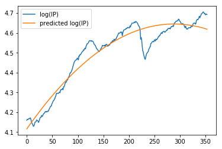


However, the research estimates $\widehat{\beta}$ from data available up to each point in time. Thus, I will repeat the calculation above to every time step.


```python
def output_gap_computer(obs):
    """
    computes the deviation of the log of industrial production from a quadratic trend.
    """
    return y[obs]-np.dot(X[:obs],beta_est(obs))[-1]
```


```python
# Next Cell parallelize for loop. It is equivalent to

# output_gap2 = []
# for i in range(1,n+1):
#     output_gap2 += [output_gap_computer(i)]
```


```python
pool = multiprocessing.Pool(4)
output_gap =[*pool.map(output_gap_computer, range(1, n+1))]
```


```python
df['output_gap']=np.concatenate(([np.nan],np.array(output_gap).reshape(-1)))
```


```python
df[['Dates','output_gap']].head()
```


<div>
<style scoped>
    .dataframe tbody tr th:only-of-type {
        vertical-align: middle;
    }

    .dataframe tbody tr th {
        vertical-align: top;
    }

    .dataframe thead th {
        text-align: right;
    }
</style>
<table border="1" class="dataframe">
  <thead>
    <tr style="text-align: right;">
      <th></th>
      <th>Dates</th>
      <th>output_gap</th>
    </tr>
  </thead>
  <tbody>
    <tr>
      <th>0</th>
      <td>NaT</td>
      <td>NaN</td>
    </tr>
    <tr>
      <th>1</th>
      <td>1990-02-28</td>
      <td>4.159576e-06</td>
    </tr>
    <tr>
      <th>2</th>
      <td>1990-03-30</td>
      <td>2.422823e-09</td>
    </tr>
    <tr>
      <th>3</th>
      <td>1990-04-30</td>
      <td>-5.646037e-09</td>
    </tr>
    <tr>
      <th>4</th>
      <td>1990-05-31</td>
      <td>5.029228e-04</td>
    </tr>
  </tbody>
</table>
</div>


### 2.7 SPX Index return


```python
df['r_SPX'] = other_df['SPX Index'].pct_change().shift(-1)
df[['Dates','r_SPX']].head()
```


<div>
<style scoped>
    .dataframe tbody tr th:only-of-type {
        vertical-align: middle;
    }

    .dataframe tbody tr th {
        vertical-align: top;
    }

    .dataframe thead th {
        text-align: right;
    }
</style>
<table border="1" class="dataframe">
  <thead>
    <tr style="text-align: right;">
      <th></th>
      <th>Dates</th>
      <th>r_SPX</th>
    </tr>
  </thead>
  <tbody>
    <tr>
      <th>0</th>
      <td>NaT</td>
      <td>0.008539</td>
    </tr>
    <tr>
      <th>1</th>
      <td>1990-02-28</td>
      <td>0.024255</td>
    </tr>
    <tr>
      <th>2</th>
      <td>1990-03-30</td>
      <td>-0.026887</td>
    </tr>
    <tr>
      <th>3</th>
      <td>1990-04-30</td>
      <td>0.091989</td>
    </tr>
    <tr>
      <th>4</th>
      <td>1990-05-31</td>
      <td>-0.008886</td>
    </tr>
  </tbody>
</table>
</div>


### 2.8 Bond return and yield


```python
def compound_return(cum_return):
    sol = (cum_return.values/100 + 1)
    for i in range(2,len(sol)):
       sol[i] = sol[i]/(cum_return.values/100 + 1)[i-1]
    return sol - 1

```


```python
df['y_bond'] = df_bonds['Close']/100
df[['Dates','y_bond']].head()
```


<div>
<style scoped>
    .dataframe tbody tr th:only-of-type {
        vertical-align: middle;
    }

    .dataframe tbody tr th {
        vertical-align: top;
    }

    .dataframe thead th {
        text-align: right;
    }
</style>
<table border="1" class="dataframe">
  <thead>
    <tr style="text-align: right;">
      <th></th>
      <th>Dates</th>
      <th>y_bond</th>
    </tr>
  </thead>
  <tbody>
    <tr>
      <th>0</th>
      <td>NaT</td>
      <td>0.0843</td>
    </tr>
    <tr>
      <th>1</th>
      <td>1990-02-28</td>
      <td>0.0851</td>
    </tr>
    <tr>
      <th>2</th>
      <td>1990-03-30</td>
      <td>0.0865</td>
    </tr>
    <tr>
      <th>3</th>
      <td>1990-04-30</td>
      <td>0.0904</td>
    </tr>
    <tr>
      <th>4</th>
      <td>1990-05-31</td>
      <td>0.0860</td>
    </tr>
  </tbody>
</table>
</div>


```python
df['r_bond'] = compound_return(df_bonds['Cumulative Return %'].shift(-1))
df[['Dates','r_bond']].head()
```


<div>
<style scoped>
    .dataframe tbody tr th:only-of-type {
        vertical-align: middle;
    }

    .dataframe tbody tr th {
        vertical-align: top;
    }

    .dataframe thead th {
        text-align: right;
    }
</style>
<table border="1" class="dataframe">
  <thead>
    <tr style="text-align: right;">
      <th></th>
      <th>Dates</th>
      <th>r_bond</th>
    </tr>
  </thead>
  <tbody>
    <tr>
      <th>0</th>
      <td>NaT</td>
      <td>0.009490</td>
    </tr>
    <tr>
      <th>1</th>
      <td>1990-02-28</td>
      <td>0.026097</td>
    </tr>
    <tr>
      <th>2</th>
      <td>1990-03-30</td>
      <td>0.045087</td>
    </tr>
    <tr>
      <th>3</th>
      <td>1990-04-30</td>
      <td>-0.048673</td>
    </tr>
    <tr>
      <th>4</th>
      <td>1990-05-31</td>
      <td>-0.019767</td>
    </tr>
  </tbody>
</table>
</div>


To check the compound_return function indeed takes cumulative return as input and computes the compounding rate of return: I will manually compute `r_bond` on `1990-03-30`. The numbers correspond to cumulative returns as can be seen from the cell below:
<br>
$$ (1.026097) = (1.009490)(1 + r) \Rightarrow r = 0.016451$$
$$ (1.072361) = (1.009490)(1.016451)(1 + r) \Rightarrow r = 0.045087 $$


```python
(df_bonds['Cumulative Return %']/100 + 1).head()
```


    0    1.000000
    1    1.009490
    2    1.026097
    3    1.072361
    4    1.020166
    Name: Cumulative Return %, dtype: float64


### 2. Bill return and yield


```python
df['y_bill'] = df_bill['Close']/100
df[['Dates','y_bill']].head()
```


<div>
<style scoped>
    .dataframe tbody tr th:only-of-type {
        vertical-align: middle;
    }

    .dataframe tbody tr th {
        vertical-align: top;
    }

    .dataframe thead th {
        text-align: right;
    }
</style>
<table border="1" class="dataframe">
  <thead>
    <tr style="text-align: right;">
      <th></th>
      <th>Dates</th>
      <th>y_bill</th>
    </tr>
  </thead>
  <tbody>
    <tr>
      <th>0</th>
      <td>NaT</td>
      <td>0.0774</td>
    </tr>
    <tr>
      <th>1</th>
      <td>1990-02-28</td>
      <td>0.0777</td>
    </tr>
    <tr>
      <th>2</th>
      <td>1990-03-30</td>
      <td>0.0780</td>
    </tr>
    <tr>
      <th>3</th>
      <td>1990-04-30</td>
      <td>0.0779</td>
    </tr>
    <tr>
      <th>4</th>
      <td>1990-05-31</td>
      <td>0.0775</td>
    </tr>
  </tbody>
</table>
</div>


```python
df['r_bill'] = compound_return(df_bill['Cumulative Return %'].shift(-1))
plt.plot(df['r_bill'])
df[['Dates','r_bill']].head()
```


<div>
<style scoped>
    .dataframe tbody tr th:only-of-type {
        vertical-align: middle;
    }

    .dataframe tbody tr th {
        vertical-align: top;
    }

    .dataframe thead th {
        text-align: right;
    }
</style>
<table border="1" class="dataframe">
  <thead>
    <tr style="text-align: right;">
      <th></th>
      <th>Dates</th>
      <th>r_bill</th>
    </tr>
  </thead>
  <tbody>
    <tr>
      <th>0</th>
      <td>NaT</td>
      <td>0.003876</td>
    </tr>
    <tr>
      <th>1</th>
      <td>1990-02-28</td>
      <td>0.007752</td>
    </tr>
    <tr>
      <th>2</th>
      <td>1990-03-30</td>
      <td>-0.001282</td>
    </tr>
    <tr>
      <th>3</th>
      <td>1990-04-30</td>
      <td>-0.005135</td>
    </tr>
    <tr>
      <th>4</th>
      <td>1990-05-31</td>
      <td>-0.001290</td>
    </tr>
  </tbody>
</table>
</div>


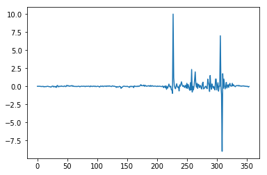


To check the compound_return function indeed takes cumulative return as input and computes the compounding rate of return: I will manually compute `r_bill` on `1990-03-30`. The numbers correspond to cumulative returns as can be seen from the cell below:
<br>
$$ (1+ 0.007752) = (1 + 0.003876)(1 + r) \Rightarrow r = 0.003861$$
$$ (1 + 0.006460) = (1 + 0.003876)(1 + 0.003861)(1 + r) \Rightarrow r = -0.001282 $$


```python
(df_bill['Cumulative Return %']/100 + 1).head()
```


    0    1.000000
    1    1.003876
    2    1.007752
    3    1.006460
    4    1.001292
    Name: Cumulative Return %, dtype: float64


```python
1.006460/((1+0.003861)*(1+0.003876)) -1
```


    -0.001282027007208475


## 3. Return Forecasts

After preprocessing available data is from 1991-03-29 to 2019-07-31


```python
processed_df = df.loc[14:353].reset_index(drop=True)
processed_df.tail()
```


<div>
<style scoped>
    .dataframe tbody tr th:only-of-type {
        vertical-align: middle;
    }

    .dataframe tbody tr th {
        vertical-align: top;
    }

    .dataframe thead th {
        text-align: right;
    }
</style>
<table border="1" class="dataframe">
  <thead>
    <tr style="text-align: right;">
      <th></th>
      <th>Dates</th>
      <th>log_DP</th>
      <th>inflation</th>
      <th>Term_Spread</th>
      <th>Default_Spread</th>
      <th>MA_1_12</th>
      <th>MA_2_12</th>
      <th>MOMBY_6</th>
      <th>MOMBY_12</th>
      <th>MOM_9</th>
      <th>MOM_12</th>
      <th>output_gap</th>
      <th>r_SPX</th>
      <th>y_bond</th>
      <th>r_bond</th>
      <th>y_bill</th>
      <th>r_bill</th>
    </tr>
  </thead>
  <tbody>
    <tr>
      <th>335</th>
      <td>2019-02-28</td>
      <td>-3.780938</td>
      <td>-0.000198</td>
      <td>0.3123</td>
      <td>1.16</td>
      <td>1.0</td>
      <td>1.0</td>
      <td>1.0</td>
      <td>1.0</td>
      <td>1.0</td>
      <td>1.0</td>
      <td>0.083610</td>
      <td>0.017924</td>
      <td>0.027123</td>
      <td>-0.109354</td>
      <td>0.0240</td>
      <td>-0.020833</td>
    </tr>
    <tr>
      <th>336</th>
      <td>2019-03-29</td>
      <td>-3.785870</td>
      <td>0.001741</td>
      <td>0.0657</td>
      <td>1.07</td>
      <td>1.0</td>
      <td>1.0</td>
      <td>1.0</td>
      <td>1.0</td>
      <td>1.0</td>
      <td>1.0</td>
      <td>0.083278</td>
      <td>0.039313</td>
      <td>0.024157</td>
      <td>0.035393</td>
      <td>0.0235</td>
      <td>0.012766</td>
    </tr>
    <tr>
      <th>337</th>
      <td>2019-04-30</td>
      <td>-3.818848</td>
      <td>0.004089</td>
      <td>0.1212</td>
      <td>1.01</td>
      <td>1.0</td>
      <td>1.0</td>
      <td>1.0</td>
      <td>1.0</td>
      <td>1.0</td>
      <td>1.0</td>
      <td>0.075730</td>
      <td>-0.065778</td>
      <td>0.025012</td>
      <td>-0.143651</td>
      <td>0.0238</td>
      <td>-0.033613</td>
    </tr>
    <tr>
      <th>338</th>
      <td>2019-05-31</td>
      <td>-3.740195</td>
      <td>0.003187</td>
      <td>-0.1581</td>
      <td>0.96</td>
      <td>0.0</td>
      <td>1.0</td>
      <td>1.0</td>
      <td>1.0</td>
      <td>0.0</td>
      <td>1.0</td>
      <td>0.076963</td>
      <td>0.068930</td>
      <td>0.021419</td>
      <td>-0.066997</td>
      <td>0.0230</td>
      <td>-0.095652</td>
    </tr>
    <tr>
      <th>339</th>
      <td>2019-06-28</td>
      <td>-3.792573</td>
      <td>0.000773</td>
      <td>-0.0816</td>
      <td>1.04</td>
      <td>1.0</td>
      <td>1.0</td>
      <td>1.0</td>
      <td>1.0</td>
      <td>1.0</td>
      <td>1.0</td>
      <td>0.077539</td>
      <td>0.013128</td>
      <td>0.019984</td>
      <td>0.010308</td>
      <td>0.0208</td>
      <td>-0.019231</td>
    </tr>
  </tbody>
</table>
</div>


### 3.1 Stock Returns

First step is to find truncated PCA for different number of eigenvalues.
<br>
PCA is implemented on the following matrix. Each variable corresponds to a set of observations and hence is a column vector.
<br>
[ $log(\frac{D}{P})$, Inflation, Term Spread, Default Spread, Output Gap, MA(1,12), MA(2,12), MOM(9), MOM(12) ] 
<br>

Second step is to come up with a decision rule on how to truncate eigenvalues.
The research paper utilizes (1) out-of-sample $R^2$ denoted as $R_{OS}^2$ and (2) Clark and West statistic.
<br>
where 
$$R_{OS}^2 = 1 - \frac{\sum_{t=1}^T (r_{t} - \widehat{r}_{t})}{\sum_{t=1}^T (r_{t} - \overline{r}_{t-1})} $$
and
<br>
<br>
$\widehat{r}_{t}$ is the fitted value using data up to t-1
<br>
$\overline{r}_{t-1}$ is the historal average using data upto t-1
<br>
<br>
Apart from $R_{OS}^2$, the paper utilizes Clark and West (2007) test. 
<br> Refer: Approximately Normal Tests for Equal Predictive Accuracy in Nested Models.
<br> Clark and West claims that test of mean squared prediction error (MSPE) typically exhibits a stylised pattern. That is, `the MSPE under Null (parsimonious model) is relatively smaller than it is expected to be because of the efficiency of parsimonious model and noises from estimating more parameters`. Therefore, authors propose an alternative hypothesis test as following:
<br>
For the hypothesis testing <br>H0: Parsimonious model (constant) MSPE is equal to or better than that of the larger model, H1: Larger model is better.
$$ \hat{f}_{t+1} = (y_{t+1} - \hat{y}_{\text{pars:} t,t+1})^2 - [(y_{t+1} - \hat{y}_{\text{large:} t,t+1})^2 - (\hat{y}_{\text{pars:} t,t+1} - \hat{y}_{\text{large:} t,t+1})^2] $$
$$ \overline{f} = \frac{1}{T}\sum_{t=1}^{T}\hat{f}_{t+1}$$
$$ s_{\hat{f}-\overline{f}}^2 = \frac{1}{T-1}\sum_{t=1}^{T}(\hat{f}_{t+1}-\overline{f})^2 $$

<br>Test statistics is: $$ CW = \frac{\overline{f}}{s_{\hat{f}-\overline{f}}/\sqrt{T}}$$ <br> the mean of $\hat{f}_{t+\tau}$ denoted as $\overline{\hat{f}_{t+\tau}}$ . With 10% significance level, reject null if $\overline{\hat{f}_{t+\tau}}$ > 1.282. With 5% significance level, reject null if $\overline{\hat{f}_{t+\tau}}$ > 1.645. For one step forecast errors, the usual least squares standard errors can be used. For autocorrelated forecast errors, an autocorrelation consistent standard error should be used.


```python
def truncated_PC(X,dim):
    eig, V = np.linalg.eig(np.matmul(X.transpose(),X))
    approx_X =  np.matmul(X,V[:,:dim])
    return approx_X
```


```python
def PC_approx_error(X,dim):
    """
    PC approximation errors in terms of frobenius norms
    """
    eig, V = np.linalg.eig(np.matmul(X.transpose(),X))
    approx_A =  np.matmul(np.matmul(V[:,:dim],
                            np.diag(eig[:dim])),
                            V[:,:dim].transpose())
    error = np.linalg.norm(approx_A - np.matmul(X.transpose(),X), ord='fro')
    return error
```


```python
def PC_fit(X,r,dim):
    """
    estimates SPX Index return in a way that minimizes l2 norm
    """
    X = np.concatenate((np.ones(X.shape[0]).reshape(-1,1),X),axis=1)
    beta = \
    np.matmul(
        np.linalg.inv(1e-6*np.eye(dim+1) + np.matmul(X.transpose(),X)),
        np.matmul(X.transpose(),r))
    return beta
```

### 3.1.1 Principle Component Regression


```python
stock_explanatory_variables = ['log_DP','inflation','Term_Spread','Default_Spread',\
                               'output_gap','MA_1_12','MA_2_12','MOM_9','MOM_12']
X = processed_df[stock_explanatory_variables].values
```

The plot of PC approximation errors in terms of frobenius norm is as following:


```python
PC_plot_df = pd.DataFrame([])
PC_plot_df['dim'] = range(3,X.shape[1]+1) 
PC_plot_df['approx_error'] = [PC_approx_error(X,dim) for dim \
                               in range(3,X.shape[1]+1)]
plt.plot('dim','approx_error',data=PC_plot_df)
plt.title("Principle Component Approximation of X'X")
plt.legend()
```


    <matplotlib.legend.Legend at 0x1159b6ef0>


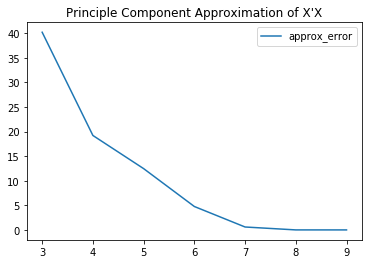


Above plot confirms that the principle component approximation works as expected

Following figures compare actual return with estimated return based on PC regression.


```python
for i in range(3,10):
    dim = i
    r = processed_df['r_SPX'].values
    X_PCA = truncated_PC(X,dim)
    w = PC_fit(X_PCA,r,dim)
    X_PCA_intercept = np.concatenate((np.ones(X_PCA.shape[0]).reshape(-1,1),X_PCA),axis=1)
    r_hat = np.matmul(X_PCA_intercept,w)
    plt.figure(i)
    PC_plot_df2 = pd.DataFrame([])
    PC_plot_df2['r_hat'] = r_hat
    PC_plot_df2['r'] = r
    plt.plot('r',data=PC_plot_df2)
    plt.plot('r_hat',data=PC_plot_df2)
    plt.title(f'Estimated return based on PCA with dimension: {dim}')
    plt.legend()

```


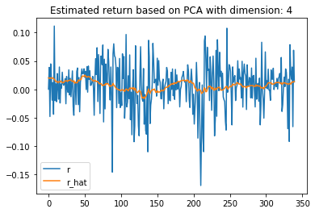


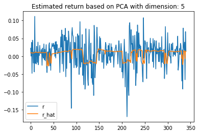


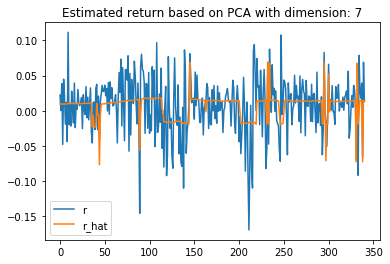


### 3.1.2  $R_{OS}^2$ Computation

Following the logic of the original paper, I will compute $R_{OS}^2$ for monthly (h=1), quartherly (h=3), semi-annual (h=6), and annual (h=12). And out-of-sample forecasts are estimated by recursive estimation windows. For example, for monthly estimation, initial 200 samples are used exclusively for fitting the model. The 201$^{\text{st}}$ sample is forecasted by the model fitted by 200 samples. The 202$^{\text{nd}}$ sample is estimated by the model fitted using 201 samples. And so on.
<br>
<br>
Below illustrations show that monthly $R_{OS}^2$ gives the highest value range. This is consistent with the original paper. 


```python
X[:200].shape
```


    (200, 9)


```python
def Rsquared_OS(X,r,dim,OS_start):
    """
    computes out-of-sample rsquared.
    First computes PCA only using explanatory variables without augmenting the data with a constant = 1.
    For regression result, added a constant to capture the y-intercept. 
    PCA_fit by default adds the constant column. Therefore, I only add the constant column to obtain
    one step ahead forecast using the weights obtained by the PCA_fit
    """
    numerator = 0
    denominator = 0
    for i in range(OS_start,len(r)):
        X_PCA = truncated_PC(X[:i],dim)
        w = PC_fit(X_PCA,r[:i],dim) 
        X_PCA_OS = truncated_PC(X[:i+1],dim)
        X_PCA_OS_intercept = np.concatenate((np.ones(X_PCA_OS.shape[0]).reshape(-1,1),X_PCA_OS),axis=1)
        r_hat = np.matmul(X_PCA_OS_intercept[-1],w)
        numerator += (r[i] - r_hat)**2
        denominator += (r[i]-r[:i].mean())**2
    R_squared_OS = 1 - numerator/(denominator + 1e-6)
    return R_squared_OS
```

### 3.1.2.1 Month $R_{OS}^2$ 


```python
plt.plot([Rsquared_OS(X,r,i,200) for i in range(1,X.shape[1]+1)])
plt.xlabel('Rank of Principle Component Approximation')
plt.ylabel('Out-of-sample R-squared')
plt.title('Month out-of-sample R-squared')
```


    Text(0.5, 1.0, 'Month out-of-sample R-squared')


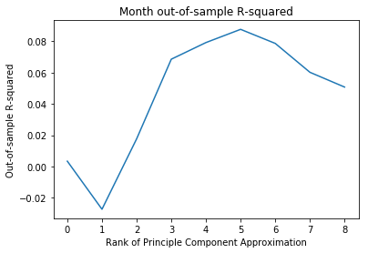


### 3.1.2.2  Quarter $R_{OS}^2$

For consistency, I utilized 66 quarterly observations exclusively for fitting the model. Following dataframe shows that 66$^{\text{th}}$ quarterly observation corresponds to 200$^{\text{th}}$ monthly observation.


```python
processed_df[2:].reset_index().set_index('Dates').resample('3M').agg('last').reset_index()[64:].head()
```


<div>
<style scoped>
    .dataframe tbody tr th:only-of-type {
        vertical-align: middle;
    }

    .dataframe tbody tr th {
        vertical-align: top;
    }

    .dataframe thead th {
        text-align: right;
    }
</style>
<table border="1" class="dataframe">
  <thead>
    <tr style="text-align: right;">
      <th></th>
      <th>Dates</th>
      <th>index</th>
      <th>log_DP</th>
      <th>inflation</th>
      <th>Term_Spread</th>
      <th>Default_Spread</th>
      <th>MA_1_12</th>
      <th>MA_2_12</th>
      <th>MOMBY_6</th>
      <th>MOMBY_12</th>
      <th>MOM_9</th>
      <th>MOM_12</th>
      <th>output_gap</th>
      <th>r_SPX</th>
      <th>y_bond</th>
      <th>r_bond</th>
      <th>y_bill</th>
      <th>r_bill</th>
    </tr>
  </thead>
  <tbody>
    <tr>
      <th>64</th>
      <td>2007-05-31</td>
      <td>194</td>
      <td>-3.843610</td>
      <td>0.003001</td>
      <td>0.2994</td>
      <td>0.92</td>
      <td>1.0</td>
      <td>1.0</td>
      <td>-1.0</td>
      <td>-1.0</td>
      <td>1.0</td>
      <td>1.0</td>
      <td>0.021707</td>
      <td>-0.017816</td>
      <td>0.048994</td>
      <td>0.025942</td>
      <td>0.0460</td>
      <td>0.017391</td>
    </tr>
    <tr>
      <th>65</th>
      <td>2007-08-31</td>
      <td>197</td>
      <td>-3.779418</td>
      <td>0.001781</td>
      <td>0.6221</td>
      <td>0.86</td>
      <td>1.0</td>
      <td>1.0</td>
      <td>1.0</td>
      <td>1.0</td>
      <td>1.0</td>
      <td>1.0</td>
      <td>0.018905</td>
      <td>0.035794</td>
      <td>0.045321</td>
      <td>0.012886</td>
      <td>0.0391</td>
      <td>-0.048593</td>
    </tr>
    <tr>
      <th>66</th>
      <td>2007-11-30</td>
      <td>200</td>
      <td>-3.788723</td>
      <td>0.003083</td>
      <td>0.8589</td>
      <td>0.96</td>
      <td>1.0</td>
      <td>1.0</td>
      <td>1.0</td>
      <td>1.0</td>
      <td>1.0</td>
      <td>1.0</td>
      <td>0.019589</td>
      <td>-0.008628</td>
      <td>0.039389</td>
      <td>0.034807</td>
      <td>0.0308</td>
      <td>0.068182</td>
    </tr>
    <tr>
      <th>67</th>
      <td>2008-02-29</td>
      <td>203</td>
      <td>-3.710938</td>
      <td>0.003448</td>
      <td>1.7002</td>
      <td>1.29</td>
      <td>0.0</td>
      <td>0.0</td>
      <td>1.0</td>
      <td>1.0</td>
      <td>0.0</td>
      <td>0.0</td>
      <td>0.009492</td>
      <td>-0.005960</td>
      <td>0.035102</td>
      <td>-0.027862</td>
      <td>0.0181</td>
      <td>-0.248619</td>
    </tr>
    <tr>
      <th>68</th>
      <td>2008-05-31</td>
      <td>206</td>
      <td>-3.774398</td>
      <td>0.002314</td>
      <td>2.2153</td>
      <td>1.36</td>
      <td>0.0</td>
      <td>0.0</td>
      <td>-1.0</td>
      <td>-1.0</td>
      <td>0.0</td>
      <td>0.0</td>
      <td>-0.008239</td>
      <td>-0.085962</td>
      <td>0.040653</td>
      <td>-0.023442</td>
      <td>0.0185</td>
      <td>0.010811</td>
    </tr>
  </tbody>
</table>
</div>


```python
X_quarter = processed_df[2:].set_index('Dates').resample('3M').agg('last')[stock_explanatory_variables].values
r_quarter = processed_df[2:].set_index('Dates').resample('3M').agg('last')['r_SPX'].values
plt.plot([Rsquared_OS(X_quarter,r_quarter,i,66) for i in range(X.shape[1]+1)])
plt.xlabel('Rank of Principle Component Approximation')
plt.ylabel('Out-of-sample R-squared')
plt.title('Quarter out-of-sample R-squared')
```


    Text(0.5, 1.0, 'Quarter out-of-sample R-squared')


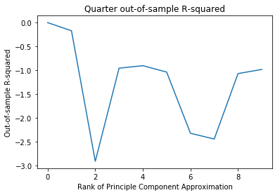


### 3.1.2.3  Semi-annual $R_{OS}^2$

For consistency, I utilized 33 semi-annually observations exclusively for fitting the model. Following dataframe shows that 33$^{\text{rd}}$ quarterly observation corresponds to 200$^{\text{th}}$ monthly observation.


```python
processed_df[2:].reset_index().set_index('Dates').resample('6M').agg('last').reset_index()[32:].head()
```


<div>
<style scoped>
    .dataframe tbody tr th:only-of-type {
        vertical-align: middle;
    }

    .dataframe tbody tr th {
        vertical-align: top;
    }

    .dataframe thead th {
        text-align: right;
    }
</style>
<table border="1" class="dataframe">
  <thead>
    <tr style="text-align: right;">
      <th></th>
      <th>Dates</th>
      <th>index</th>
      <th>log_DP</th>
      <th>inflation</th>
      <th>Term_Spread</th>
      <th>Default_Spread</th>
      <th>MA_1_12</th>
      <th>MA_2_12</th>
      <th>MOMBY_6</th>
      <th>MOMBY_12</th>
      <th>MOM_9</th>
      <th>MOM_12</th>
      <th>output_gap</th>
      <th>r_SPX</th>
      <th>y_bond</th>
      <th>r_bond</th>
      <th>y_bill</th>
      <th>r_bill</th>
    </tr>
  </thead>
  <tbody>
    <tr>
      <th>32</th>
      <td>2007-05-31</td>
      <td>194</td>
      <td>-3.843610</td>
      <td>0.003001</td>
      <td>0.2994</td>
      <td>0.92</td>
      <td>1.0</td>
      <td>1.0</td>
      <td>-1.0</td>
      <td>-1.0</td>
      <td>1.0</td>
      <td>1.0</td>
      <td>0.021707</td>
      <td>-0.017816</td>
      <td>0.048994</td>
      <td>0.025942</td>
      <td>0.0460</td>
      <td>0.017391</td>
    </tr>
    <tr>
      <th>33</th>
      <td>2007-11-30</td>
      <td>200</td>
      <td>-3.788723</td>
      <td>0.003083</td>
      <td>0.8589</td>
      <td>0.96</td>
      <td>1.0</td>
      <td>1.0</td>
      <td>1.0</td>
      <td>1.0</td>
      <td>1.0</td>
      <td>1.0</td>
      <td>0.019589</td>
      <td>-0.008628</td>
      <td>0.039389</td>
      <td>0.034807</td>
      <td>0.0308</td>
      <td>0.068182</td>
    </tr>
    <tr>
      <th>34</th>
      <td>2008-05-31</td>
      <td>206</td>
      <td>-3.774398</td>
      <td>0.002314</td>
      <td>2.2153</td>
      <td>1.36</td>
      <td>0.0</td>
      <td>0.0</td>
      <td>-1.0</td>
      <td>-1.0</td>
      <td>0.0</td>
      <td>0.0</td>
      <td>-0.008239</td>
      <td>-0.085962</td>
      <td>0.040653</td>
      <td>-0.023442</td>
      <td>0.0185</td>
      <td>0.010811</td>
    </tr>
    <tr>
      <th>35</th>
      <td>2008-11-30</td>
      <td>212</td>
      <td>-3.339371</td>
      <td>-0.008598</td>
      <td>2.9100</td>
      <td>3.09</td>
      <td>0.0</td>
      <td>0.0</td>
      <td>1.0</td>
      <td>1.0</td>
      <td>0.0</td>
      <td>0.0</td>
      <td>-0.071761</td>
      <td>0.007822</td>
      <td>0.029200</td>
      <td>-0.295240</td>
      <td>0.0001</td>
      <td>10.000000</td>
    </tr>
    <tr>
      <th>36</th>
      <td>2009-05-31</td>
      <td>218</td>
      <td>-3.346824</td>
      <td>0.001007</td>
      <td>3.3204</td>
      <td>2.52</td>
      <td>0.0</td>
      <td>0.0</td>
      <td>-1.0</td>
      <td>-1.0</td>
      <td>0.0</td>
      <td>0.0</td>
      <td>-0.137647</td>
      <td>0.000196</td>
      <td>0.034604</td>
      <td>0.020894</td>
      <td>0.0014</td>
      <td>0.357143</td>
    </tr>
  </tbody>
</table>
</div>


```python
X_semi = processed_df[2:].set_index('Dates').resample('6M').agg('last')[stock_explanatory_variables].values
r_semi = processed_df[2:].set_index('Dates').resample('6M').agg('last')['r_SPX'].values
plt.plot([Rsquared_OS(X_semi,r_semi,i,33) for i in range(X.shape[1]+1)])
plt.xlabel('Rank of Principle Component Approximation')
plt.ylabel('Out-of-sample R-squared')
plt.title('Semi-annual out-of-sample R-squared')
```


    Text(0.5, 1.0, 'Semi-annual out-of-sample R-squared')


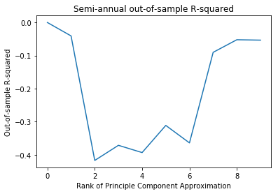


### 3.1.2.4  Annual $R_{OS}^2$

For consistency, I utilized 33 semi-annually observations exclusively for fitting the model. Following dataframe shows that 33$^{\text{rd}}$ quarterly observation corresponds to 200$^{\text{th}}$ monthly observation.


```python
processed_df.reset_index().set_index('Dates').resample('Y').agg(lambda x: x[-2]).reset_index()[15:].head()
```


<div>
<style scoped>
    .dataframe tbody tr th:only-of-type {
        vertical-align: middle;
    }

    .dataframe tbody tr th {
        vertical-align: top;
    }

    .dataframe thead th {
        text-align: right;
    }
</style>
<table border="1" class="dataframe">
  <thead>
    <tr style="text-align: right;">
      <th></th>
      <th>Dates</th>
      <th>index</th>
      <th>log_DP</th>
      <th>inflation</th>
      <th>Term_Spread</th>
      <th>Default_Spread</th>
      <th>MA_1_12</th>
      <th>MA_2_12</th>
      <th>MOMBY_6</th>
      <th>MOMBY_12</th>
      <th>MOM_9</th>
      <th>MOM_12</th>
      <th>output_gap</th>
      <th>r_SPX</th>
      <th>y_bond</th>
      <th>r_bond</th>
      <th>y_bill</th>
      <th>r_bill</th>
    </tr>
  </thead>
  <tbody>
    <tr>
      <th>15</th>
      <td>2006-12-31</td>
      <td>188</td>
      <td>-3.814893</td>
      <td>-0.004438</td>
      <td>-0.4390</td>
      <td>0.87</td>
      <td>1.0</td>
      <td>1.0</td>
      <td>1.0</td>
      <td>1.0</td>
      <td>1.0</td>
      <td>1.0</td>
      <td>0.006390</td>
      <td>0.012616</td>
      <td>0.044610</td>
      <td>0.050482</td>
      <td>0.0490</td>
      <td>-0.002041</td>
    </tr>
    <tr>
      <th>16</th>
      <td>2007-12-31</td>
      <td>200</td>
      <td>-3.788723</td>
      <td>0.003083</td>
      <td>0.8589</td>
      <td>0.96</td>
      <td>1.0</td>
      <td>1.0</td>
      <td>1.0</td>
      <td>1.0</td>
      <td>1.0</td>
      <td>1.0</td>
      <td>0.019589</td>
      <td>-0.008628</td>
      <td>0.039389</td>
      <td>0.034807</td>
      <td>0.0308</td>
      <td>0.068182</td>
    </tr>
    <tr>
      <th>17</th>
      <td>2008-12-31</td>
      <td>212</td>
      <td>-3.339371</td>
      <td>-0.008598</td>
      <td>2.9100</td>
      <td>3.09</td>
      <td>0.0</td>
      <td>0.0</td>
      <td>1.0</td>
      <td>1.0</td>
      <td>0.0</td>
      <td>0.0</td>
      <td>-0.071761</td>
      <td>0.007822</td>
      <td>0.029200</td>
      <td>-0.295240</td>
      <td>0.0001</td>
      <td>10.000000</td>
    </tr>
    <tr>
      <th>18</th>
      <td>2009-12-31</td>
      <td>224</td>
      <td>-3.617410</td>
      <td>0.003002</td>
      <td>3.1402</td>
      <td>1.13</td>
      <td>1.0</td>
      <td>1.0</td>
      <td>1.0</td>
      <td>1.0</td>
      <td>1.0</td>
      <td>1.0</td>
      <td>-0.077893</td>
      <td>0.017771</td>
      <td>0.032002</td>
      <td>0.197863</td>
      <td>0.0006</td>
      <td>0.000000</td>
    </tr>
    <tr>
      <th>19</th>
      <td>2010-12-31</td>
      <td>236</td>
      <td>-3.755558</td>
      <td>0.003482</td>
      <td>2.6254</td>
      <td>1.05</td>
      <td>1.0</td>
      <td>1.0</td>
      <td>-1.0</td>
      <td>-1.0</td>
      <td>1.0</td>
      <td>1.0</td>
      <td>-0.001713</td>
      <td>0.065300</td>
      <td>0.027954</td>
      <td>0.176969</td>
      <td>0.0017</td>
      <td>-0.294118</td>
    </tr>
  </tbody>
</table>
</div>


```python
X_annual = (processed_df.set_index('Dates').resample('Y')
            .agg(lambda x: x[-2])[stock_explanatory_variables].values)
r_annual = (processed_df.set_index('Dates').resample('Y')
            .agg(lambda x: x[-2])['r_SPX'].values)
plt.plot([Rsquared_OS(X_annual,r_annual,i,16) for i in range(X.shape[1]+1)])
plt.xlabel('Rank of Principle Component Approximation')
plt.ylabel('Out-of-sample R-squared')
plt.title('Annual out-of-sample R-squared')
```

    /Users/gimdong-geon/python3_cooking/lib/python3.7/site-packages/numpy/core/numeric.py:538: ComplexWarning: Casting complex values to real discards the imaginary part
      return array(a, dtype, copy=False, order=order)


    Text(0.5, 1.0, 'Annual out-of-sample R-squared')


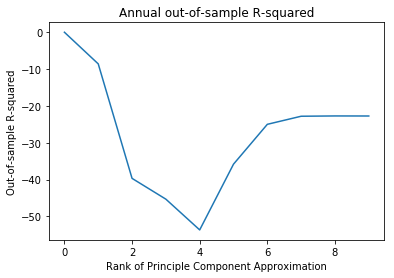


### 3.1.3  Clark and Wald (2007) Test Statistics Computation


```python
def CW_test(X,r,dim,OS_start):
    """
    computes Clark and Wald test statistics.
    First computes PCA only using explanatory variables without augmenting the data with a constant = 1.
    For regression result, added a constant to capture the y-intercept. 
    PCA_fit by default adds the constant column. Therefore, I only add the constant column to obtain
    one step ahead forecast using the weights obtained by the PCA_fit

    """
    denom = len(r) - OS_start
    num = []
    for i in range(OS_start,len(r)):
        X_PCA = truncated_PC(X[:i],dim)
        w = PC_fit(X_PCA,r[:i],dim)
        X_PCA_OS = truncated_PC(X[:i+1],dim)
        X_PCA_OS_intercept = np.concatenate((np.ones(X_PCA_OS.shape[0]).reshape(-1,1),X_PCA_OS),axis=1)
        r_hat = np.matmul(X_PCA_OS_intercept[-1],w)
        num += [(r[i]-r[:i].mean())**2 - (r[i] - r_hat)**2  + (r[:i].mean() - r_hat)**2]
    f_bar = np.array(num).mean()
    CW = np.sqrt(denom) * f_bar / np.std(np.array(num) - f_bar,ddof=1)
    return CW
```


```python
my_dict = {'month':200,'quarter':66,'semi':33,'annual':16}

i=0
for item in my_dict.keys():
    plt.figure(i)
    if item == 'month':
        plt.plot([CW_test(X,r,i,my_dict[item]) for i in range(X.shape[1]+1)])
        plt.xlabel('Rank of Principle Component Approximation')
        plt.ylabel('CW test statistics')
        plt.title('Month Clark and Wald Test')
    else:
        eval(f'plt.plot([CW_test(X_{item},r_{item},i,my_dict[item]) for i in range(X.shape[1]+1)])')
        plt.xlabel('Rank of Principle Component Approximation')
        plt.ylabel('CW test statistics')
        if item == 'semi':
            plt.title(f'{item[0].upper()}{item[1:]}' + '-annual Clark and Wald Test')
        else:
            plt.title(f'{item[0].upper()}{item[1:]} Clark and Wald Test')
    i+=1
```


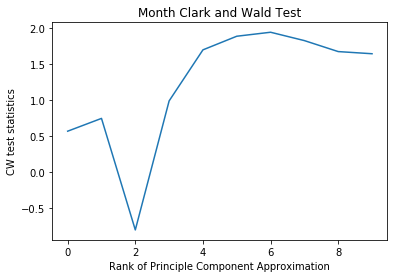


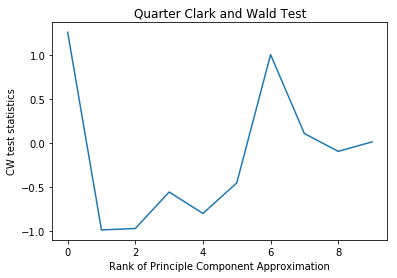


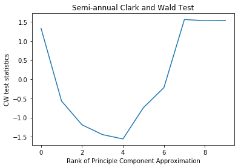


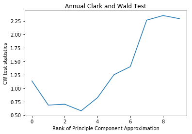


### 3.2 Bond Returns

The logic of this section is equivalent to the stock returns. First section deals with principal component, the second section the $R_{OS}^2$ and the third section the Clark Wald test statistics.


```python
bonds_explanatory_variables = ['y_bond','inflation','Term_Spread','Default_Spread',\
                               'output_gap','MOMBY_6','MOMBY_12']
X = processed_df[bonds_explanatory_variables].values
r = processed_df['r_bond'].values

X_quarter = (processed_df[2:].set_index('Dates').resample('3M')
             .agg('last')[bonds_explanatory_variables].values)
y_quarter = (processed_df[2:].set_index('Dates')
             .resample('3M').agg('last')['r_bond'].values)
X_semi = (processed_df[2:].set_index('Dates').resample('6M')
          .agg('last')[bonds_explanatory_variables].values)
y_semi = (processed_df[2:].set_index('Dates')
          .resample('6M').agg('last')['r_bond'].values)
X_annual = (processed_df.set_index('Dates').resample('Y')
        .agg(lambda x: x[-2])[bonds_explanatory_variables].values)
y_annual = (processed_df.set_index('Dates').resample('Y')
        .agg(lambda x: x[-2])['r_bond'].values)

```


```python
my_dict = {'month':200,'quarter':66,'semi':33,'annual':16}

i=0
for item in my_dict.keys():
    plt.figure(i)
    if item == 'month':
        plt.plot([Rsquared_OS(X,r,i,my_dict[item]) for i in range(X.shape[1]+1)])
        plt.xlabel('Bond: Rank of Principle Component Approximation')
        plt.ylabel('Bond: Out-of-sample R-squared')
        plt.title('Bond: Month out-of-sample R-squared')
    else:
        eval(f'plt.plot([Rsquared_OS(X_{item},r_{item},i,my_dict[item]) for i in range(X.shape[1]+1)])')
        plt.xlabel('Rank of Principle Component Approximation')
        plt.ylabel('Bond: Out-of-sample R-squared')
        if item == 'semi':
            plt.title('Bond: '+f'{item[0].upper()}{item[1:]}' + '-annual out-of-sample R-squared')
        else:
            plt.title('Bond: '+ f'{item[0].upper()}{item[1:]} out-of-sample R-squared')
    i+=1


```


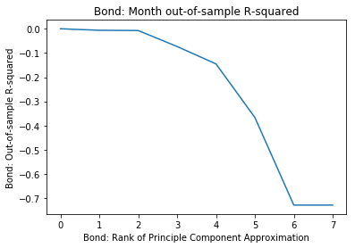


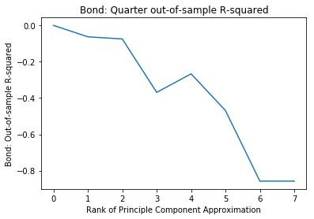


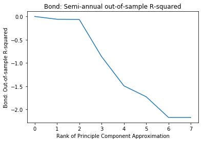


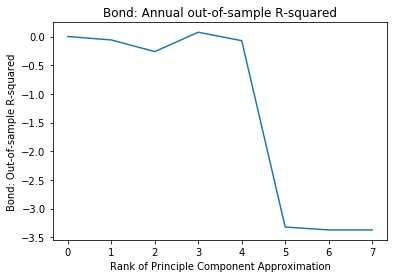


```python
my_dict = {'month':200,'quarter':66,'semi':33,'annual':16}

i=0
for item in my_dict.keys():
    plt.figure(i)
    if item == 'month':
        plt.plot([CW_test(X,r,i,my_dict[item]) for i in range(X.shape[1]+1)])
        plt.xlabel('Rank of Principle Component Approximation')
        plt.ylabel('CW test statistics')
        plt.title('Bond: Month Clark and Wald Test')
    else:
        eval(f'plt.plot([CW_test(X_{item},r_{item},i,my_dict[item]) for i in range(X.shape[1]+1)])')
        plt.xlabel('Rank of Principle Component Approximation')
        plt.ylabel('Bond: CW test statistics')
        if item == 'semi':
            plt.title('Bond: '+f'{item[0].upper()}{item[1:]}' + '-annual Clark and Wald Test')
        else:
            plt.title('Bond: '+ f'{item[0].upper()}{item[1:]} Clark and Wald Test')
    i+=1
```


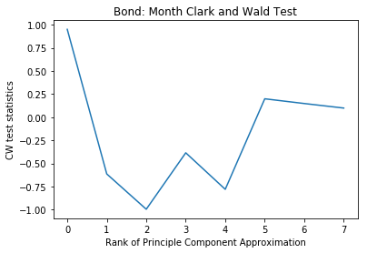


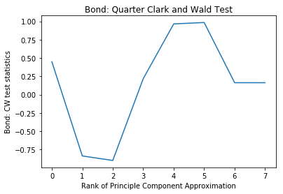


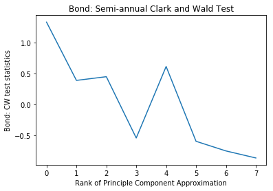


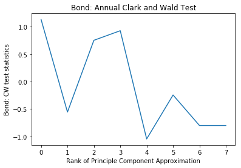


### 3.3 Bill Returns

The result is not as expected for bill returns. I suspect that the compound return data provided by the Factset is not accurate. For visualization of the data, Please refer to the next cell. The data shows the 1-month return. However, the maximum return was 10.0 and minimum value was -9. Clearly, return of -9 does not make sense. As I have checked the function I used to compute the return, I should find another source to obtain the return data. However, I do not currently know where I can retrieve the data.


```python
plt.plot( processed_df['r_bill'].values)
```


    [<matplotlib.lines.Line2D at 0x116a7f940>]


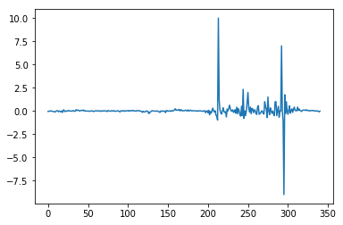


```python
processed_df['r_bill'].values.min()
```


    -8.999999999997765


```python
X = processed_df['y_bill'].values.reshape(-1,1)
r = processed_df['r_bill'].values

X_quarter = (processed_df[2:].set_index('Dates').resample('3M')
             .agg('last')[['y_bill']].values)
y_quarter = (processed_df[2:].set_index('Dates')
             .resample('3M').agg('last')['r_bill'].values)
X_semi = (processed_df[2:].set_index('Dates').resample('6M')
          .agg('last')[['y_bill']].values)
y_semi = (processed_df[2:].set_index('Dates')
          .resample('6M').agg('last')['r_bill'].values)
X_annual = (processed_df.set_index('Dates').resample('Y')
        .agg(lambda x: x[-2])[['y_bill']].values)
y_annual = (processed_df.set_index('Dates').resample('Y')
        .agg(lambda x: x[-2])['r_bill'].values)
```


```python
my_dict = {'month':200,'quarter':66,'semi':33,'annual':16}

i=0
for item in my_dict.keys():
    if item=='month':
        print('Month Rsquared_OS: ', Rsquared_OS(X,r,1,my_dict[item]))
    else:
        eval( f'print(item," Rsquared_OS: ",Rsquared_OS(X_{item},r_{item},1,my_dict[item]))')

```

    Month Rsquared_OS:  -0.009179932272639357
    quarter  Rsquared_OS:  -0.10034942055336504
    semi  Rsquared_OS:  -0.036215348588125584
    annual  Rsquared_OS:  -0.025368552452170956


```python
my_dict = {'month':200,'quarter':66,'semi':33,'annual':16}

i=0
for item in my_dict.keys():
    if item=='month':
        print('Month Rsquared_OS: ', CW_test(X,r,1,my_dict[item]))
    else:
        eval( f'print(item," Rsquared_OS: ",CW_test(X_{item},r_{item},1,my_dict[item]))')

```

    Month Rsquared_OS:  -0.15740600529154933
    quarter  Rsquared_OS:  -0.5358886092568653
    semi  Rsquared_OS:  0.44965609947281726
    annual  Rsquared_OS:  0.0908765054611409


## 4. Portfolio Performance Evaluation

Choice of the number of Principal Components for Month:
Stock: 7, Bond: 2

## 4.1 Return Estimate


```python
r_actual = processed_df[['r_SPX','r_bond','r_bill']].values
```


```python
r_hat_SPX = []
for i in range(r_actual.shape[0]):
    X_stock_PCA = truncated_PC(processed_df[stock_explanatory_variables][:i].values,7)
    w_stock = PC_fit(X_stock_PCA,r_actual[:i,0],7)
    x_stock_PCA_new = np.concatenate((np.ones(1),truncated_PC(processed_df[stock_explanatory_variables][:i+1].values,7)[-1,:]))
    r_hat_SPX+=[np.dot(x_stock_PCA_new,w_stock)]
```


```python
plt.plot(r_hat_SPX[200:])
plt.plot(r_actual[200:,0])
plt.legend()
```

    No handles with labels found to put in legend.


    <matplotlib.legend.Legend at 0x1169d3c88>


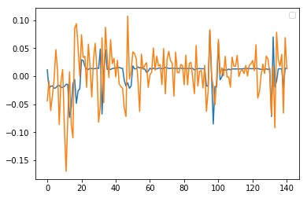


```python
r_hat_bond = []
for i in range(r_actual.shape[0]):
    X_bond_PCA = truncated_PC(processed_df[bonds_explanatory_variables][:i].values,2)
    w_bond = PC_fit(X_bond_PCA,r_actual[:i,1],2)
    x_bond_PCA_new = np.concatenate((np.ones(1),truncated_PC(processed_df[bonds_explanatory_variables][:i+1].values,2)[-1,:]))
    r_hat_bond+=[np.dot(x_bond_PCA_new,w_bond)]
```


```python
plt.plot(r_hat_bond[200:])
plt.plot(r_actual[200:,1])
plt.legend()
```

    No handles with labels found to put in legend.


    <matplotlib.legend.Legend at 0x1169b6d30>


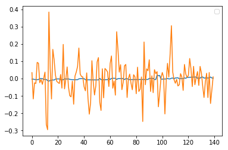


```python
r_hat_bill = []
X_bill = np.concatenate((np.ones(r_actual.shape[0]).reshape(-1,1),
                         processed_df['y_bill'].values.reshape(-1,1)),axis=1)
for i in range(r_actual.shape[0]):
    w_bill = np.matmul(
                    np.matmul(
                        np.linalg.inv(1e-6*np.eye(2) + np.matmul(
                            X_bill[:i-1,:].transpose(),X_bill[:i-1,:])),
                            X_bill[:i-1,:].transpose()),
                        r_actual[:i-1,2])
    r_hat_bill+=[np.dot(X_bill[i-1,:],w_bill)]
    
    
    
```


```python
plt.plot(r_hat_bill[200:])
plt.plot(r_actual[200:,2])
plt.legend()
```

    No handles with labels found to put in legend.


    <matplotlib.legend.Legend at 0x116d11f98>


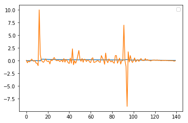


```python
r_hat = pd.DataFrame(r_hat_SPX,columns = ['r_hat_SPX'])
r_hat['r_hat_bond'] = pd.Series(r_hat_bond)
r_hat['r_hat_bill'] = pd.Series(r_hat_bill)
r_hat = r_hat.astype(float)
```

    /Users/gimdong-geon/python3_cooking/lib/python3.7/site-packages/pandas/core/dtypes/cast.py:702: ComplexWarning: Casting complex values to real discards the imaginary part
      return arr.astype(dtype, copy=True)


## 4.2 EWMA Covariance Estimate

I referred the formula of Exponentially Weighted Moving Average from Table 5.1 of Riskmetrics - technical document. It is as following:
$$Cov(r^i, r^j)= (1-\lambda)\sum_{t=0}^{T-1}\lambda^t (r_{t}^{i}-\overline{r}_{t}^{i})(r_{t}^{j}-\overline{r}_{t}^{j}) \quad i,j \in{\{stock, bond, bill\}}$$
The way I compute this amount is:
$$ X =\begin{pmatrix}
r^{stock}_0 -\overline{r}^{stock}& r^{bond}_0  -\overline{r}^{bond}& r^{bill}_0 -\overline{r}^{bill}\\ 
r^{stock}_1 -\overline{r}^{stock}&  r^{bond}_1 -\overline{r}^{bond}& r^{bill}_1 -\overline{r}^{bill}\\ 
r^{stock}_3 -\overline{r}^{stock}&  r^{bond}_2 -\overline{r}^{bond}& r^{bill}_2 -\overline{r}^{bill}
\end{pmatrix} \\
\Rightarrow
\tilde{X}=\sqrt{1-\lambda}\bigl(\begin{smallmatrix}
1 & 0 & 0\\ 
 0&  \lambda^{0.5}& 0\\ 
 0&  0& \lambda
\end{smallmatrix}\bigr)X =\sqrt{1-\lambda} \begin{pmatrix}
r^{stock}_0 -\overline{r}^{stock}& r^{bond}_0  -\overline{r}^{bond}& r^{bill}_0 -\overline{r}^{bill}\\ 
\lambda^{0.5}(r^{stock}_1 -\overline{r}^{stock})&  \lambda^{0.5}(r^{bond}_1 -\overline{r}^{bond})&\lambda^{0.5}( r^{bill}_1 -\overline{r}^{bill})\\ 
\lambda(r^{stock}_2 -\overline{r}^{stock})&  \lambda(r^{bond}_2 -\overline{r}^{bond})&\lambda( r^{bill}_2 -\overline{r}^{bill})
\end{pmatrix}= (\tilde{r}^{stock},\tilde{r}^{bond},\tilde{r}^{bill} )
\\
$$

$$\Rightarrow
\tilde{X}^T\tilde{X} = \begin{pmatrix}
 (\tilde{r}^{stock})^T\tilde{r}^{stock}& (\tilde{r}^{stock})^T\tilde{r}^{bond} &(\tilde{r}^{stock})^T\tilde{r}^{bill} \\ 
 (\tilde{r}^{bond})^T\tilde{r}^{stock}&  (\tilde{r}^{bond})^T\tilde{r}^{bond}& (\tilde{r}^{bond})^T\tilde{r}^{bill}\\ 
 (\tilde{r}^{bill})^T\tilde{r}^{stock}&  (\tilde{r}^{bill})^T\tilde{r}^{bond}& (\tilde{r}^{bill})^T\tilde{r}^{bill}
\end{pmatrix} = \begin{pmatrix}
Cov(r^{stock},r^{stock}) &  Cov(r^{stock},r^{bond})&Cov(r^{stock},r^{bill}) \\ 
Cov(r^{bond},r^{stock}) & Cov(r^{bond},r^{ond}) & Cov(r^{bond},r^{bill})\\ 
Cov(r^{bill},r^{stock}) & Cov(r^{bill},r^{bond}) & Cov(r^{bill},r^{bill})
\end{pmatrix}
$$


```python
def EWMA(t):
    decay = 0.94
    A = np.matmul(np.diag([np.sqrt((1-decay)*decay**i) 
                           for i in range(t+1)]),r_actual[:t+1])
    return np.matmul(A.T,A)
```


```python
EWMA(200)
```


    array([[ 0.00119016, -0.00066904, -0.00047128],
           [-0.00066904,  0.00164213,  0.00131968],
           [-0.00047128,  0.00131968,  0.00323162]])


## 4.3 Black Litterman $\mu$ and $\Sigma$

### 4.3.1 Covariance Matrix of Active Views

$$\omega_{j} = \left( \frac{1-c_{j}}{c_{j}} \right)p_{j}\hat{\Sigma}_{t:t+h}p_{j}^{T}\quad \text{for} \space j = \text{stock, bond, or bill}$$
where $p_{stock}, p_{bond}, p_{bill}$ are first, second and third rows of $P = I_{3}$. And, $c_{stock} = 0.25, c_{bond} = 0.50, c_{bill} = 0.75$. Note that larger the c is, less relevant is the investor view and when c equals 1 then investor view is considered majestic. The rationale for the choice of parameter is that if regression result is credit-worthy (characterized by high $R^2_{OS}$) then do not utilize information about views.

I slightly modify the weights `c` because of poor quality of bond/bill returns data I obtained.


```python
omega_stock = [(1/0.75 -1)*EWMA(t)[0,0] for t in range(r_actual.shape[0])]
omega_bond  = [(1/0.5 -1)*EWMA(t)[1,1] for t in range(r_actual.shape[0])]
omega_bill  = [(1/0.25 -1)*EWMA(t)[2,2] for t in range(r_actual.shape[0])]
```


```python
Omega = []
for i in range(len(omega_stock)):
    Omega += [np.diag([omega_stock[i],omega_bond[i],omega_bill[i]])]
```

### 4.3.2 $\mu_{BL}$ And $\Sigma_{BL}$

$$\mu_{BL} = \mu + \hat{\Sigma} P^T(P\hat{\Sigma}P^T+\Omega)^{-1}(V-P \mu) $$
$$ \Sigma_{BL} = \hat{\Sigma} - \hat{\Sigma}P^T(P\hat{\Sigma}P^T+\Omega)^{-1}P\hat{\Sigma}$$

Da Silva(2009) claims that Black-Litterman was derived under the mean-variance portfolio optimization rather than optimizing the common active management performance measure, the information ratio. And, this resulted in a bias that could lead to unintentional trades.

The authors' remedy for this issue pertains to the practice of obtaining implied equilibrium excess returns through $\mu = \gamma \Sigma \omega_B$ where $\gamma$ is a risk-aversion coefficient. The author asserts to set $\mu = 0$. And, $\hat{r}$ is considered to be the active views $V$ and $P$ is assumed to be $I_3$.
In summary,
$$\mu_{BL} = \hat{\Sigma}(\hat{\Sigma}+\Omega)^{-1}\hat{r} $$
$$ \Sigma_{BL} = \hat{\Sigma} - \hat{\Sigma}(\hat{\Sigma}+\Omega)^{-1}\hat{\Sigma}$$


```python
mu_BL = []
Sigma_BL = []
for i in range(len(r_actual)):
    mu_BL+=[np.dot(np.matmul(EWMA(i),np.linalg.inv(1e-6 + EWMA(i) + Omega[i])),r_hat.values[i] )]
    Sigma_BL+=[EWMA(i)-np.matmul(np.matmul(EWMA(i),np.linalg.inv(1e-6 +EWMA(i)+Omega[i])),EWMA(i))]
```

### 4.3.3 Black-Litterman Return Expectation and Variance

$log(r)|view \sim N(\mu_{BL},\Sigma_{BL}) \\ \Rightarrow E[P^i_{t}] = P^i_{0}exp\left(\mu_{BL,i} + \frac{1}{2} \Sigma_{BL,(i,i)}\right) \quad \text{where} \quad i\in{\{stock,bond,bill\}}
 \\ \quad Cov[P^i_{t},P^j_{t}] =P^i_{0}P^i_{0}exp\left(\mu_{BL,i}+\mu_{BL,j}\right)exp\left(\frac{1}{2}\left(\Sigma_{BL,(ii)} +   \Sigma_{BL,(jj)}\right)\right)\bigodot\left(exp\left(\Sigma_{BL,(ij)}-1\right)\right) \quad \text{where}  \quad  i,j\in{\{stock,bond,bill\}}        $


```python
m=[]
S=[]
for i in range(len(r_actual)):
    m += [np.exp(mu_BL[i]+0.5*np.diag(Sigma_BL[i])).reshape(-1,1)  - 1]
    S += [np.multiply(np.matmul(np.exp(mu_BL[i]+0.5*np.diag(Sigma_BL[i])).reshape(-1,1),
          np.exp(mu_BL[i]+0.5*np.diag(Sigma_BL[i])).reshape(-1,1).T),np.exp(Sigma_BL[i]) - 1)]
```

### 4.3.4 DAA Portfolio Optimization

Initial attempt:

Optimization problem is:


\begin{aligned}
\max_{w} \quad & \left ( w-w_{bench} \right )^Tm\\
\textrm{s.t.} \quad & \left \| R\left ( w-w_{bench} \right )\right \|_2^2 \leq (h/12)TE^2\\
 & w^T1_3 =1    \\
 & w  \geq w_{LB}
\end{aligned}

where $R$ is the Cholesky Decomposition of $S$


```python
def cholesky(A):
    """
    computes left cholesky matrix. Advantage of this matrix over np.linalg.cholesky
    is that first few observation of S matrix is not positive definite which creates
    an error message.
    """
    L = np.eye(3)
    L[1:,0]=-A[1:,0]/A[0,0]
    tmp = np.matmul(L,A)
    L2 = np.eye(3)
    L2[2,1] = -tmp[2,1]/tmp[1,1]
    diag = np.sqrt(np.matmul(np.matmul(np.matmul(L2,tmp),L.T),L2.T))
    Linv=np.eye(3)
    Linv[1:,0] = -L[1:,0]/L[0,0]
    L2inv=np.eye(3)
    L2inv[2,1] = -L2[2,1]/L2[1,1]
    Left = np.matmul(np.matmul(Linv,L2inv),diag)
    return Left
```

Sanity Check:


```python
R = cholesky(S[20]).T
R.T - np.linalg.cholesky(S[20])
```


    array([[0., 0., 0.],
           [0., 0., 0.],
           [0., 0., 0.]])


```python
for i in range(len(r_actual))[:5]:
    print(cholesky(S[i]))
```

    [[ 5.32797217e-05  0.00000000e+00  0.00000000e+00]
     [-5.73580103e-04  2.58327850e-07  0.00000000e+00]
     [-6.21356947e-03  2.69271475e-05  4.56954959e-06]]
    [[      nan 0.              nan]
     [      nan 0.0007352       nan]
     [      nan 0.0078131       nan]]
    [[ 0.00785924  0.          0.        ]
     [-0.000789    0.00282752  0.        ]
     [ 0.00037972  0.00165482  0.00759579]]
    [[ 0.00707922  0.          0.        ]
     [-0.00119289  0.0043134   0.        ]
     [ 0.00031536  0.00185641  0.00908291]]
    [[ 9.99118761e-03  0.00000000e+00  0.00000000e+00]
     [-1.14962585e-03  5.56672793e-03  0.00000000e+00]
     [ 2.54922379e-05  4.17563252e-03  7.35078286e-03]]


    /Users/gimdong-geon/python3_cooking/lib/python3.7/site-packages/ipykernel_launcher.py:12: RuntimeWarning: invalid value encountered in sqrt
      if sys.path[0] == '':


S is not psd for many observations. So I avoided cholesky

\begin{aligned}
\max_{w} \quad &  w^Tm\\
\textrm{s.t.} \quad &  \left ( w-w_{bench} \right )^TS\left ( w-w_{bench} \right ) \ \leq (h/12)TE^2\\
 & w^T1_3 =1    \\
 & w  \geq w_{LB}
\end{aligned}

To get constraints, I use fstring with list comprehension as below:


```python
cone = '+'.join([f'((w{i}-w_bench[{i}])*S[i][{i},{j}]*(w{j}-w_bench[{j}]))' for i in range(3) for j in range(3)])
cone
```


    '((w0-w_bench[0])*S[i][0,0]*(w0-w_bench[0]))+((w0-w_bench[0])*S[i][0,1]*(w1-w_bench[1]))+((w0-w_bench[0])*S[i][0,2]*(w2-w_bench[2]))+((w1-w_bench[1])*S[i][1,0]*(w0-w_bench[0]))+((w1-w_bench[1])*S[i][1,1]*(w1-w_bench[1]))+((w1-w_bench[1])*S[i][1,2]*(w2-w_bench[2]))+((w2-w_bench[2])*S[i][2,0]*(w0-w_bench[0]))+((w2-w_bench[2])*S[i][2,1]*(w1-w_bench[1]))+((w2-w_bench[2])*S[i][2,2]*(w2-w_bench[2]))'


```python
w_LB = 0.05*np.ones(3)
w_bench = np.array([0.65,0.3,0.05])
TE=0.02
w = np.array([np.nan,np.nan,np.nan]).reshape(-1,3)
for i in range(len(r_actual)):
    # Create a new model

        model = Model("qcp")
        model.setParam('OutputFlag', 0)
        # Create variables
        w0 = model.addVar(name="w0")
        w1 = model.addVar(name="w1")
        w2 = model.addVar(name="w2")

        # Set objective: x
        obj = m[i][0][0]*w0 + m[i][1][0]*w1 + m[i][2][0]*w2 
        model.setObjective(obj, GRB.MAXIMIZE)

        model.addConstr(w0 + w1 + w2 == 1, "c0")
        model.addConstr(w0  >= w_LB[0], "c1")
        model.addConstr(w1  >= w_LB[1], "c2")
        model.addConstr(w2  >= w_LB[2], "c3")

        # Add second-order cone: 
        eval('model.addConstr(' + cone + '<= (TE**2 *(1/12)), "qc0")')
        model.optimize()

        if i%100==0:
            print(f'{i}th observation: ')
            for v in model.getVars():
                print('%s %g' % (v.varName, v.x))
            print('Obj: %g' % obj.getValue())
        w = np.concatenate((w,np.array([model.getVars()[i].x for i in range(3)]).reshape(-1,3)))
w = w[1:,:]
```

    0th observation: 
    w0 0.0500041
    w1 0.0500182
    w2 0.899978
    Obj: 0.00750459
    100th observation: 
    w0 0.817374
    w1 0.132397
    w2 0.050229
    Obj: 0.0055681
    200th observation: 
    w0 0.818005
    w1 0.131857
    w2 0.0501372
    Obj: 0.00629528
    300th observation: 
    w0 0.70951
    w1 0.126051
    w2 0.164439
    Obj: 0.0125932


```python
plt.plot(w[:,0])
plt.title("DAA stock weight")
```


    Text(0.5, 1.0, 'DAA stock weight')


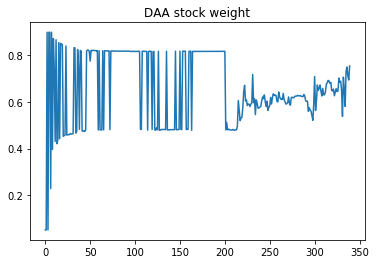


```python
plt.plot(w[:,1])
plt.title("DAA bond weight")
```


    Text(0.5, 1.0, 'DAA bond weight')


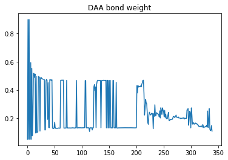


```python
plt.plot(w[:,2])
plt.title("DAA bill weight")
```


    Text(0.5, 1.0, 'DAA bill weight')


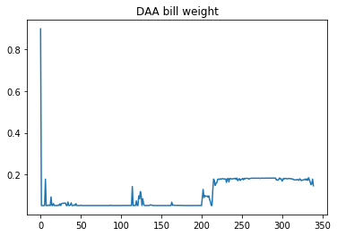


### 4.3.5 Portfolio Performance Statistics

### 4.3.5.1 Annualized Return

Below cell tries to adjusts for erratic data. Bill return is not expected to change by 500% over a month.


```python
np.place(w[:,2], np.abs(r_actual[:,2])>5, 0)
w[np.abs(r_actual[:,2])>5]
```


    array([[0.48110419, 0.46817669, 0.        ],
           [0.60319534, 0.21560353, 0.        ],
           [0.57516302, 0.24964986, 0.        ]])


```python
r_portfolio_actual = np.multiply(r_actual,w).sum(axis=1)
r_portfolio_bench = np.multiply(r_actual,w_bench).sum(axis=1)
```


```python
DAA_geo_return = (((r_portfolio_actual[200:]+1).prod()**(1/r_portfolio_actual[200:].shape[0]))-1) * 12
DAA_geo_return
```


    0.13076375431897436


```python
Bench_geo_return =(((r_portfolio_bench[200:]+1).prod()**(1/r_portfolio_bench[200:].shape[0]))-1) * 12
Bench_geo_return 
```


    0.0824949523121612


Annualized geometric return of DAA portfolio from November 2007 (observation index 200) to July is 13.97% and that of benchmark portfolio is 7.49%

### 4.3.5.2 Standard Deviation


```python
DAA_std = r_portfolio_actual[200:].std(ddof=1)
DAA_std
```


    0.0952343518306201


```python
Bench_std = r_portfolio_bench[200:].std(ddof=1)
Bench_std
```


    0.0772344189520475


### 4.3.5.3 Maximum Drawdown


```python
DAA_mdd = -((r_portfolio_actual[200:] + 1).cumprod().min() - 1)
DAA_mdd
```


    0.5258912498691841


```python
Bench_mdd = -((r_portfolio_bench[200:] + 1).cumprod().min() - 1)
Bench_mdd
```


    0.4146251668854053


### 4.3.5.4 Calmar Ratio


```python
DAA_Calmar = DAA_geo_return/DAA_mdd
DAA_Calmar 
```


    0.24865170194693664


```python
Bench_Calmar = Bench_geo_return/Bench_mdd
Bench_Calmar
```


    0.198962723203344


### 4.3.5.4 Average Excess Return


```python
Avg_Excess_Return = DAA_geo_return - Bench_geo_return
Avg_Excess_Return
```


    0.04826880200681316


### 4.3.5.5 Tracking Error


```python
Tracking_Error = (r_portfolio_actual[200:] - r_portfolio_bench[200:]).std(ddof=1) *np.sqrt(12)
Tracking_Error
```


    0.3114030108919141


### 4.3.5.6 Information Ratio


```python
IR = Avg_Excess_Return/Tracking_Error
IR
```


    0.1550042880721116


## 4.4 Transaction Cost and Performance Evaluation

### 4.4.1 Transaction Cost


```python
transaction_cost = np.arange(0,0.0455,0.0005) # 50 basis points increments
transaction_cost
```


    array([0.    , 0.0005, 0.001 , 0.0015, 0.002 , 0.0025, 0.003 , 0.0035,
           0.004 , 0.0045, 0.005 , 0.0055, 0.006 , 0.0065, 0.007 , 0.0075,
           0.008 , 0.0085, 0.009 , 0.0095, 0.01  , 0.0105, 0.011 , 0.0115,
           0.012 , 0.0125, 0.013 , 0.0135, 0.014 , 0.0145, 0.015 , 0.0155,
           0.016 , 0.0165, 0.017 , 0.0175, 0.018 , 0.0185, 0.019 , 0.0195,
           0.02  , 0.0205, 0.021 , 0.0215, 0.022 , 0.0225, 0.023 , 0.0235,
           0.024 , 0.0245, 0.025 , 0.0255, 0.026 , 0.0265, 0.027 , 0.0275,
           0.028 , 0.0285, 0.029 , 0.0295, 0.03  , 0.0305, 0.031 , 0.0315,
           0.032 , 0.0325, 0.033 , 0.0335, 0.034 , 0.0345, 0.035 , 0.0355,
           0.036 , 0.0365, 0.037 , 0.0375, 0.038 , 0.0385, 0.039 , 0.0395,
           0.04  , 0.0405, 0.041 , 0.0415, 0.042 , 0.0425, 0.043 , 0.0435,
           0.044 , 0.0445, 0.045 ])


```python
r_sign = np.sign(r_portfolio_actual)
```


```python
transaction_df = processed_df[['Dates']]
transaction_df['tc_0_bp'] = r_portfolio_actual 
for i in range(1,len(transaction_cost)):
    string = f'transaction_df["tc_{i*50}_bp"] = np.multiply(r_portfolio_actual,'
    string += '(1-r_sign*transaction_cost[i]))'
    exec(string)
transaction_df.set_index('Dates', inplace=True)
```

    /Users/gimdong-geon/python3_cooking/lib/python3.7/site-packages/ipykernel_launcher.py:2: SettingWithCopyWarning: 
    A value is trying to be set on a copy of a slice from a DataFrame.
    Try using .loc[row_indexer,col_indexer] = value instead
    
    See the caveats in the documentation: http://pandas.pydata.org/pandas-docs/stable/indexing.html#indexing-view-versus-copy
      
    /Users/gimdong-geon/python3_cooking/lib/python3.7/site-packages/ipykernel_launcher.py:1: SettingWithCopyWarning: 
    A value is trying to be set on a copy of a slice from a DataFrame.
    Try using .loc[row_indexer,col_indexer] = value instead
    
    See the caveats in the documentation: http://pandas.pydata.org/pandas-docs/stable/indexing.html#indexing-view-versus-copy
      """Entry point for launching an IPython kernel.


```python
transaction_df.head()
```


<div>
<style scoped>
    .dataframe tbody tr th:only-of-type {
        vertical-align: middle;
    }

    .dataframe tbody tr th {
        vertical-align: top;
    }

    .dataframe thead th {
        text-align: right;
    }
</style>
<table border="1" class="dataframe">
  <thead>
    <tr style="text-align: right;">
      <th></th>
      <th>tc_0_bp</th>
      <th>tc_50_bp</th>
      <th>tc_100_bp</th>
      <th>tc_150_bp</th>
      <th>tc_200_bp</th>
      <th>tc_250_bp</th>
      <th>tc_300_bp</th>
      <th>tc_350_bp</th>
      <th>tc_400_bp</th>
      <th>tc_450_bp</th>
      <th>...</th>
      <th>tc_4050_bp</th>
      <th>tc_4100_bp</th>
      <th>tc_4150_bp</th>
      <th>tc_4200_bp</th>
      <th>tc_4250_bp</th>
      <th>tc_4300_bp</th>
      <th>tc_4350_bp</th>
      <th>tc_4400_bp</th>
      <th>tc_4450_bp</th>
      <th>tc_4500_bp</th>
    </tr>
    <tr>
      <th>Dates</th>
      <th></th>
      <th></th>
      <th></th>
      <th></th>
      <th></th>
      <th></th>
      <th></th>
      <th></th>
      <th></th>
      <th></th>
      <th></th>
      <th></th>
      <th></th>
      <th></th>
      <th></th>
      <th></th>
      <th></th>
      <th></th>
      <th></th>
      <th></th>
      <th></th>
    </tr>
  </thead>
  <tbody>
    <tr>
      <th>1991-03-29</th>
      <td>-0.036231</td>
      <td>-0.036249</td>
      <td>-0.036267</td>
      <td>-0.036285</td>
      <td>-0.036303</td>
      <td>-0.036321</td>
      <td>-0.036340</td>
      <td>-0.036358</td>
      <td>-0.036376</td>
      <td>-0.036394</td>
      <td>...</td>
      <td>-0.037698</td>
      <td>-0.037716</td>
      <td>-0.037734</td>
      <td>-0.037753</td>
      <td>-0.037771</td>
      <td>-0.037789</td>
      <td>-0.037807</td>
      <td>-0.037825</td>
      <td>-0.037843</td>
      <td>-0.037861</td>
    </tr>
    <tr>
      <th>1991-04-30</th>
      <td>0.006605</td>
      <td>0.006602</td>
      <td>0.006598</td>
      <td>0.006595</td>
      <td>0.006592</td>
      <td>0.006589</td>
      <td>0.006585</td>
      <td>0.006582</td>
      <td>0.006579</td>
      <td>0.006575</td>
      <td>...</td>
      <td>0.006338</td>
      <td>0.006334</td>
      <td>0.006331</td>
      <td>0.006328</td>
      <td>0.006324</td>
      <td>0.006321</td>
      <td>0.006318</td>
      <td>0.006314</td>
      <td>0.006311</td>
      <td>0.006308</td>
    </tr>
    <tr>
      <th>1991-05-31</th>
      <td>-0.041896</td>
      <td>-0.041917</td>
      <td>-0.041938</td>
      <td>-0.041959</td>
      <td>-0.041980</td>
      <td>-0.042001</td>
      <td>-0.042022</td>
      <td>-0.042043</td>
      <td>-0.042064</td>
      <td>-0.042085</td>
      <td>...</td>
      <td>-0.043593</td>
      <td>-0.043614</td>
      <td>-0.043635</td>
      <td>-0.043656</td>
      <td>-0.043677</td>
      <td>-0.043698</td>
      <td>-0.043719</td>
      <td>-0.043740</td>
      <td>-0.043761</td>
      <td>-0.043782</td>
    </tr>
    <tr>
      <th>1991-06-28</th>
      <td>-0.002216</td>
      <td>-0.002217</td>
      <td>-0.002218</td>
      <td>-0.002220</td>
      <td>-0.002221</td>
      <td>-0.002222</td>
      <td>-0.002223</td>
      <td>-0.002224</td>
      <td>-0.002225</td>
      <td>-0.002226</td>
      <td>...</td>
      <td>-0.002306</td>
      <td>-0.002307</td>
      <td>-0.002308</td>
      <td>-0.002309</td>
      <td>-0.002310</td>
      <td>-0.002312</td>
      <td>-0.002313</td>
      <td>-0.002314</td>
      <td>-0.002315</td>
      <td>-0.002316</td>
    </tr>
    <tr>
      <th>1991-07-31</th>
      <td>0.013559</td>
      <td>0.013552</td>
      <td>0.013545</td>
      <td>0.013538</td>
      <td>0.013531</td>
      <td>0.013525</td>
      <td>0.013518</td>
      <td>0.013511</td>
      <td>0.013504</td>
      <td>0.013497</td>
      <td>...</td>
      <td>0.013009</td>
      <td>0.013003</td>
      <td>0.012996</td>
      <td>0.012989</td>
      <td>0.012982</td>
      <td>0.012975</td>
      <td>0.012969</td>
      <td>0.012962</td>
      <td>0.012955</td>
      <td>0.012948</td>
    </tr>
  </tbody>
</table>
<p>5 rows × 91 columns</p>
</div>


```python
r_sign_bench = np.sign(r_portfolio_bench)

transaction_benchmark_df = processed_df[['Dates']]
transaction_benchmark_df['tc_0_bp'] = r_portfolio_bench 
for i in range(1,len(transaction_cost)):
    string = f'transaction_benchmark_df["tc_{i*50}_bp"] = np.multiply(r_portfolio_bench,'
    string += '(1-r_sign_bench*transaction_cost[i]))'
    exec(string)
transaction_benchmark_df.set_index('Dates', inplace=True)
```

    /Users/gimdong-geon/python3_cooking/lib/python3.7/site-packages/ipykernel_launcher.py:4: SettingWithCopyWarning: 
    A value is trying to be set on a copy of a slice from a DataFrame.
    Try using .loc[row_indexer,col_indexer] = value instead
    
    See the caveats in the documentation: http://pandas.pydata.org/pandas-docs/stable/indexing.html#indexing-view-versus-copy
      after removing the cwd from sys.path.
    /Users/gimdong-geon/python3_cooking/lib/python3.7/site-packages/ipykernel_launcher.py:1: SettingWithCopyWarning: 
    A value is trying to be set on a copy of a slice from a DataFrame.
    Try using .loc[row_indexer,col_indexer] = value instead
    
    See the caveats in the documentation: http://pandas.pydata.org/pandas-docs/stable/indexing.html#indexing-view-versus-copy
      """Entry point for launching an IPython kernel.


```python
transaction_benchmark_df.head()
```


<div>
<style scoped>
    .dataframe tbody tr th:only-of-type {
        vertical-align: middle;
    }

    .dataframe tbody tr th {
        vertical-align: top;
    }

    .dataframe thead th {
        text-align: right;
    }
</style>
<table border="1" class="dataframe">
  <thead>
    <tr style="text-align: right;">
      <th></th>
      <th>tc_0_bp</th>
      <th>tc_50_bp</th>
      <th>tc_100_bp</th>
      <th>tc_150_bp</th>
      <th>tc_200_bp</th>
      <th>tc_250_bp</th>
      <th>tc_300_bp</th>
      <th>tc_350_bp</th>
      <th>tc_400_bp</th>
      <th>tc_450_bp</th>
      <th>...</th>
      <th>tc_4050_bp</th>
      <th>tc_4100_bp</th>
      <th>tc_4150_bp</th>
      <th>tc_4200_bp</th>
      <th>tc_4250_bp</th>
      <th>tc_4300_bp</th>
      <th>tc_4350_bp</th>
      <th>tc_4400_bp</th>
      <th>tc_4450_bp</th>
      <th>tc_4500_bp</th>
    </tr>
    <tr>
      <th>Dates</th>
      <th></th>
      <th></th>
      <th></th>
      <th></th>
      <th></th>
      <th></th>
      <th></th>
      <th></th>
      <th></th>
      <th></th>
      <th></th>
      <th></th>
      <th></th>
      <th></th>
      <th></th>
      <th></th>
      <th></th>
      <th></th>
      <th></th>
      <th></th>
      <th></th>
    </tr>
  </thead>
  <tbody>
    <tr>
      <th>1991-03-29</th>
      <td>-0.002896</td>
      <td>-0.002898</td>
      <td>-0.002899</td>
      <td>-0.002901</td>
      <td>-0.002902</td>
      <td>-0.002904</td>
      <td>-0.002905</td>
      <td>-0.002906</td>
      <td>-0.002908</td>
      <td>-0.002909</td>
      <td>...</td>
      <td>-0.003014</td>
      <td>-0.003015</td>
      <td>-0.003016</td>
      <td>-0.003018</td>
      <td>-0.003019</td>
      <td>-0.003021</td>
      <td>-0.003022</td>
      <td>-0.003024</td>
      <td>-0.003025</td>
      <td>-0.003027</td>
    </tr>
    <tr>
      <th>1991-04-30</th>
      <td>0.026753</td>
      <td>0.026740</td>
      <td>0.026726</td>
      <td>0.026713</td>
      <td>0.026700</td>
      <td>0.026686</td>
      <td>0.026673</td>
      <td>0.026659</td>
      <td>0.026646</td>
      <td>0.026633</td>
      <td>...</td>
      <td>0.025670</td>
      <td>0.025656</td>
      <td>0.025643</td>
      <td>0.025629</td>
      <td>0.025616</td>
      <td>0.025603</td>
      <td>0.025589</td>
      <td>0.025576</td>
      <td>0.025563</td>
      <td>0.025549</td>
    </tr>
    <tr>
      <th>1991-05-31</th>
      <td>-0.024340</td>
      <td>-0.024352</td>
      <td>-0.024364</td>
      <td>-0.024377</td>
      <td>-0.024389</td>
      <td>-0.024401</td>
      <td>-0.024413</td>
      <td>-0.024425</td>
      <td>-0.024437</td>
      <td>-0.024450</td>
      <td>...</td>
      <td>-0.025326</td>
      <td>-0.025338</td>
      <td>-0.025350</td>
      <td>-0.025362</td>
      <td>-0.025375</td>
      <td>-0.025387</td>
      <td>-0.025399</td>
      <td>-0.025411</td>
      <td>-0.025423</td>
      <td>-0.025435</td>
    </tr>
    <tr>
      <th>1991-06-28</th>
      <td>0.027612</td>
      <td>0.027598</td>
      <td>0.027584</td>
      <td>0.027571</td>
      <td>0.027557</td>
      <td>0.027543</td>
      <td>0.027529</td>
      <td>0.027515</td>
      <td>0.027502</td>
      <td>0.027488</td>
      <td>...</td>
      <td>0.026494</td>
      <td>0.026480</td>
      <td>0.026466</td>
      <td>0.026452</td>
      <td>0.026439</td>
      <td>0.026425</td>
      <td>0.026411</td>
      <td>0.026397</td>
      <td>0.026383</td>
      <td>0.026369</td>
    </tr>
    <tr>
      <th>1991-07-31</th>
      <td>-0.002939</td>
      <td>-0.002941</td>
      <td>-0.002942</td>
      <td>-0.002943</td>
      <td>-0.002945</td>
      <td>-0.002946</td>
      <td>-0.002948</td>
      <td>-0.002949</td>
      <td>-0.002951</td>
      <td>-0.002952</td>
      <td>...</td>
      <td>-0.003058</td>
      <td>-0.003060</td>
      <td>-0.003061</td>
      <td>-0.003062</td>
      <td>-0.003064</td>
      <td>-0.003065</td>
      <td>-0.003067</td>
      <td>-0.003068</td>
      <td>-0.003070</td>
      <td>-0.003071</td>
    </tr>
  </tbody>
</table>
<p>5 rows × 91 columns</p>
</div>


### 4.4.2 Performance Evaluation

### 4.4.2.1 Annualized Return


```python
tc_perf_df = pd.DataFrame([f'{i*50} bp' for i in range(0,len(transaction_cost))])
tc_perf_df.columns=['transaction_cost']
```


```python
tc_return = []
tc_bench_return = []
for i in range(0,len(transaction_cost)):
    string = f"tc_return += [(((transaction_df['tc_{i*50}_bp'].values[200:]+1)"
    string += f'.prod()**(1/transaction_df["tc_{i*50}_bp"].values[200:].shape[0]))-1) * 12]'
    exec(string)
    string2 = f"tc_bench_return += [(((transaction_benchmark_df['tc_{i*50}_bp'].values[200:]+1)"
    string2 += f'.prod()**(1/transaction_benchmark_df["tc_{i*50}_bp"].values[200:].shape[0]))-1) * 12]'
    exec(string2)
```


```python
tc_perf_df['annual_return'] = tc_return
tc_perf_df['annual_return_bench'] = tc_bench_return
```


```python
tc_perf_df.head()
```


<div>
<style scoped>
    .dataframe tbody tr th:only-of-type {
        vertical-align: middle;
    }

    .dataframe tbody tr th {
        vertical-align: top;
    }

    .dataframe thead th {
        text-align: right;
    }
</style>
<table border="1" class="dataframe">
  <thead>
    <tr style="text-align: right;">
      <th></th>
      <th>transaction_cost</th>
      <th>annual_return</th>
      <th>annual_return_bench</th>
    </tr>
  </thead>
  <tbody>
    <tr>
      <th>0</th>
      <td>0 bp</td>
      <td>0.130764</td>
      <td>0.082495</td>
    </tr>
    <tr>
      <th>1</th>
      <td>50 bp</td>
      <td>0.130371</td>
      <td>0.082196</td>
    </tr>
    <tr>
      <th>2</th>
      <td>100 bp</td>
      <td>0.129977</td>
      <td>0.081897</td>
    </tr>
    <tr>
      <th>3</th>
      <td>150 bp</td>
      <td>0.129584</td>
      <td>0.081598</td>
    </tr>
    <tr>
      <th>4</th>
      <td>200 bp</td>
      <td>0.129191</td>
      <td>0.081300</td>
    </tr>
  </tbody>
</table>
</div>


### 4.4.2.2 Standard Deviation


```python
tc_perf_df['std'] = [eval(f'transaction_df["tc_{i*50}_bp"].values[200:].std(ddof=1)')
                                    for i in range(0,len(transaction_cost))]
```


```python
tc_perf_df['std_bench'] = [eval(f'transaction_benchmark_df["tc_{i*50}_bp"].values[200:].std(ddof=1)')
                                    for i in range(0,len(transaction_cost))]
```


```python
tc_perf_df.head()
```


<div>
<style scoped>
    .dataframe tbody tr th:only-of-type {
        vertical-align: middle;
    }

    .dataframe tbody tr th {
        vertical-align: top;
    }

    .dataframe thead th {
        text-align: right;
    }
</style>
<table border="1" class="dataframe">
  <thead>
    <tr style="text-align: right;">
      <th></th>
      <th>transaction_cost</th>
      <th>annual_return</th>
      <th>annual_return_bench</th>
      <th>std</th>
      <th>std_bench</th>
    </tr>
  </thead>
  <tbody>
    <tr>
      <th>0</th>
      <td>0 bp</td>
      <td>0.130764</td>
      <td>0.082495</td>
      <td>0.095234</td>
      <td>0.077234</td>
    </tr>
    <tr>
      <th>1</th>
      <td>50 bp</td>
      <td>0.130371</td>
      <td>0.082196</td>
      <td>0.095222</td>
      <td>0.077230</td>
    </tr>
    <tr>
      <th>2</th>
      <td>100 bp</td>
      <td>0.129977</td>
      <td>0.081897</td>
      <td>0.095209</td>
      <td>0.077226</td>
    </tr>
    <tr>
      <th>3</th>
      <td>150 bp</td>
      <td>0.129584</td>
      <td>0.081598</td>
      <td>0.095196</td>
      <td>0.077221</td>
    </tr>
    <tr>
      <th>4</th>
      <td>200 bp</td>
      <td>0.129191</td>
      <td>0.081300</td>
      <td>0.095184</td>
      <td>0.077217</td>
    </tr>
  </tbody>
</table>
</div>


### 4.4.2.3 Maximum Drawdown


```python
tc_perf_df['max_drawdown'] = [eval(f'(transaction_df["tc_{i*50}_bp"].values[200:]+1).cumprod().min()')
                                    for i in range(0,len(transaction_cost))]
```


```python
tc_perf_df['max_drawdown_bench'] = [eval(f'(transaction_benchmark_df["tc_{i*50}_bp"].values[200:]+1).cumprod().min()')
                                    for i in range(0,len(transaction_cost))]
```


```python
tc_perf_df.head()
```


<div>
<style scoped>
    .dataframe tbody tr th:only-of-type {
        vertical-align: middle;
    }

    .dataframe tbody tr th {
        vertical-align: top;
    }

    .dataframe thead th {
        text-align: right;
    }
</style>
<table border="1" class="dataframe">
  <thead>
    <tr style="text-align: right;">
      <th></th>
      <th>transaction_cost</th>
      <th>annual_return</th>
      <th>annual_return_bench</th>
      <th>std</th>
      <th>std_bench</th>
      <th>max_drawdown</th>
      <th>max_drawdown_bench</th>
    </tr>
  </thead>
  <tbody>
    <tr>
      <th>0</th>
      <td>0 bp</td>
      <td>0.130764</td>
      <td>0.082495</td>
      <td>0.095234</td>
      <td>0.077234</td>
      <td>0.474109</td>
      <td>0.585375</td>
    </tr>
    <tr>
      <th>1</th>
      <td>50 bp</td>
      <td>0.130371</td>
      <td>0.082196</td>
      <td>0.095222</td>
      <td>0.077230</td>
      <td>0.473852</td>
      <td>0.585139</td>
    </tr>
    <tr>
      <th>2</th>
      <td>100 bp</td>
      <td>0.129977</td>
      <td>0.081897</td>
      <td>0.095209</td>
      <td>0.077226</td>
      <td>0.473596</td>
      <td>0.584904</td>
    </tr>
    <tr>
      <th>3</th>
      <td>150 bp</td>
      <td>0.129584</td>
      <td>0.081598</td>
      <td>0.095196</td>
      <td>0.077221</td>
      <td>0.473339</td>
      <td>0.584668</td>
    </tr>
    <tr>
      <th>4</th>
      <td>200 bp</td>
      <td>0.129191</td>
      <td>0.081300</td>
      <td>0.095184</td>
      <td>0.077217</td>
      <td>0.473083</td>
      <td>0.584433</td>
    </tr>
  </tbody>
</table>
</div>


### 4.4.2.4 Calmar Ratio


```python
tc_perf_df['calmar'] = tc_perf_df['annual_return'].values/tc_perf_df['max_drawdown'].values
```


```python
tc_perf_df['calmar_bench'] = tc_perf_df['annual_return_bench'].values/tc_perf_df['max_drawdown_bench'].values
```


```python
tc_perf_df.head()
```


<div>
<style scoped>
    .dataframe tbody tr th:only-of-type {
        vertical-align: middle;
    }

    .dataframe tbody tr th {
        vertical-align: top;
    }

    .dataframe thead th {
        text-align: right;
    }
</style>
<table border="1" class="dataframe">
  <thead>
    <tr style="text-align: right;">
      <th></th>
      <th>transaction_cost</th>
      <th>annual_return</th>
      <th>annual_return_bench</th>
      <th>std</th>
      <th>std_bench</th>
      <th>max_drawdown</th>
      <th>max_drawdown_bench</th>
      <th>calmar</th>
      <th>calmar_bench</th>
    </tr>
  </thead>
  <tbody>
    <tr>
      <th>0</th>
      <td>0 bp</td>
      <td>0.130764</td>
      <td>0.082495</td>
      <td>0.095234</td>
      <td>0.077234</td>
      <td>0.474109</td>
      <td>0.585375</td>
      <td>0.275810</td>
      <td>0.140927</td>
    </tr>
    <tr>
      <th>1</th>
      <td>50 bp</td>
      <td>0.130371</td>
      <td>0.082196</td>
      <td>0.095222</td>
      <td>0.077230</td>
      <td>0.473852</td>
      <td>0.585139</td>
      <td>0.275129</td>
      <td>0.140473</td>
    </tr>
    <tr>
      <th>2</th>
      <td>100 bp</td>
      <td>0.129977</td>
      <td>0.081897</td>
      <td>0.095209</td>
      <td>0.077226</td>
      <td>0.473596</td>
      <td>0.584904</td>
      <td>0.274448</td>
      <td>0.140018</td>
    </tr>
    <tr>
      <th>3</th>
      <td>150 bp</td>
      <td>0.129584</td>
      <td>0.081598</td>
      <td>0.095196</td>
      <td>0.077221</td>
      <td>0.473339</td>
      <td>0.584668</td>
      <td>0.273766</td>
      <td>0.139564</td>
    </tr>
    <tr>
      <th>4</th>
      <td>200 bp</td>
      <td>0.129191</td>
      <td>0.081300</td>
      <td>0.095184</td>
      <td>0.077217</td>
      <td>0.473083</td>
      <td>0.584433</td>
      <td>0.273083</td>
      <td>0.139108</td>
    </tr>
  </tbody>
</table>
</div>


### 4.4.2.5 Average Excess Return


```python
tc_perf_df['avg_excess_return'] = tc_perf_df['annual_return'] - tc_perf_df['annual_return_bench']
```


```python
tc_perf_df.head()
```


<div>
<style scoped>
    .dataframe tbody tr th:only-of-type {
        vertical-align: middle;
    }

    .dataframe tbody tr th {
        vertical-align: top;
    }

    .dataframe thead th {
        text-align: right;
    }
</style>
<table border="1" class="dataframe">
  <thead>
    <tr style="text-align: right;">
      <th></th>
      <th>transaction_cost</th>
      <th>annual_return</th>
      <th>annual_return_bench</th>
      <th>std</th>
      <th>std_bench</th>
      <th>max_drawdown</th>
      <th>max_drawdown_bench</th>
      <th>calmar</th>
      <th>calmar_bench</th>
      <th>avg_excess_return</th>
    </tr>
  </thead>
  <tbody>
    <tr>
      <th>0</th>
      <td>0 bp</td>
      <td>0.130764</td>
      <td>0.082495</td>
      <td>0.095234</td>
      <td>0.077234</td>
      <td>0.474109</td>
      <td>0.585375</td>
      <td>0.275810</td>
      <td>0.140927</td>
      <td>0.048269</td>
    </tr>
    <tr>
      <th>1</th>
      <td>50 bp</td>
      <td>0.130371</td>
      <td>0.082196</td>
      <td>0.095222</td>
      <td>0.077230</td>
      <td>0.473852</td>
      <td>0.585139</td>
      <td>0.275129</td>
      <td>0.140473</td>
      <td>0.048174</td>
    </tr>
    <tr>
      <th>2</th>
      <td>100 bp</td>
      <td>0.129977</td>
      <td>0.081897</td>
      <td>0.095209</td>
      <td>0.077226</td>
      <td>0.473596</td>
      <td>0.584904</td>
      <td>0.274448</td>
      <td>0.140018</td>
      <td>0.048080</td>
    </tr>
    <tr>
      <th>3</th>
      <td>150 bp</td>
      <td>0.129584</td>
      <td>0.081598</td>
      <td>0.095196</td>
      <td>0.077221</td>
      <td>0.473339</td>
      <td>0.584668</td>
      <td>0.273766</td>
      <td>0.139564</td>
      <td>0.047986</td>
    </tr>
    <tr>
      <th>4</th>
      <td>200 bp</td>
      <td>0.129191</td>
      <td>0.081300</td>
      <td>0.095184</td>
      <td>0.077217</td>
      <td>0.473083</td>
      <td>0.584433</td>
      <td>0.273083</td>
      <td>0.139108</td>
      <td>0.047891</td>
    </tr>
  </tbody>
</table>
</div>


### 4.4.2.6 Tracking Error


```python
string = f'(transaction_df["tc_{i*50}_bp"].values[200:] '
string += f'- transaction_benchmark_df["tc_{i*50}_bp"].values[200:]).std(ddof=1)*np.sqrt(12)'
tc_perf_df['tracking_error'] = [eval(string) for i in range(0,len(transaction_cost))]
```


```python
tc_perf_df.head()
```


<div>
<style scoped>
    .dataframe tbody tr th:only-of-type {
        vertical-align: middle;
    }

    .dataframe tbody tr th {
        vertical-align: top;
    }

    .dataframe thead th {
        text-align: right;
    }
</style>
<table border="1" class="dataframe">
  <thead>
    <tr style="text-align: right;">
      <th></th>
      <th>transaction_cost</th>
      <th>annual_return</th>
      <th>annual_return_bench</th>
      <th>std</th>
      <th>std_bench</th>
      <th>max_drawdown</th>
      <th>max_drawdown_bench</th>
      <th>calmar</th>
      <th>calmar_bench</th>
      <th>avg_excess_return</th>
      <th>tracking_error</th>
    </tr>
  </thead>
  <tbody>
    <tr>
      <th>0</th>
      <td>0 bp</td>
      <td>0.130764</td>
      <td>0.082495</td>
      <td>0.095234</td>
      <td>0.077234</td>
      <td>0.474109</td>
      <td>0.585375</td>
      <td>0.275810</td>
      <td>0.140927</td>
      <td>0.048269</td>
      <td>0.306196</td>
    </tr>
    <tr>
      <th>1</th>
      <td>50 bp</td>
      <td>0.130371</td>
      <td>0.082196</td>
      <td>0.095222</td>
      <td>0.077230</td>
      <td>0.473852</td>
      <td>0.585139</td>
      <td>0.275129</td>
      <td>0.140473</td>
      <td>0.048174</td>
      <td>0.306196</td>
    </tr>
    <tr>
      <th>2</th>
      <td>100 bp</td>
      <td>0.129977</td>
      <td>0.081897</td>
      <td>0.095209</td>
      <td>0.077226</td>
      <td>0.473596</td>
      <td>0.584904</td>
      <td>0.274448</td>
      <td>0.140018</td>
      <td>0.048080</td>
      <td>0.306196</td>
    </tr>
    <tr>
      <th>3</th>
      <td>150 bp</td>
      <td>0.129584</td>
      <td>0.081598</td>
      <td>0.095196</td>
      <td>0.077221</td>
      <td>0.473339</td>
      <td>0.584668</td>
      <td>0.273766</td>
      <td>0.139564</td>
      <td>0.047986</td>
      <td>0.306196</td>
    </tr>
    <tr>
      <th>4</th>
      <td>200 bp</td>
      <td>0.129191</td>
      <td>0.081300</td>
      <td>0.095184</td>
      <td>0.077217</td>
      <td>0.473083</td>
      <td>0.584433</td>
      <td>0.273083</td>
      <td>0.139108</td>
      <td>0.047891</td>
      <td>0.306196</td>
    </tr>
  </tbody>
</table>
</div>


### 4.3.2.7 Information Ratio


```python
tc_perf_df['IR'] = tc_perf_df['avg_excess_return'].values/tc_perf_df['tracking_error'].values
```


```python
tc_perf_df.head()
```


<div>
<style scoped>
    .dataframe tbody tr th:only-of-type {
        vertical-align: middle;
    }

    .dataframe tbody tr th {
        vertical-align: top;
    }

    .dataframe thead th {
        text-align: right;
    }
</style>
<table border="1" class="dataframe">
  <thead>
    <tr style="text-align: right;">
      <th></th>
      <th>transaction_cost</th>
      <th>annual_return</th>
      <th>annual_return_bench</th>
      <th>std</th>
      <th>std_bench</th>
      <th>max_drawdown</th>
      <th>max_drawdown_bench</th>
      <th>calmar</th>
      <th>calmar_bench</th>
      <th>avg_excess_return</th>
      <th>tracking_error</th>
      <th>IR</th>
    </tr>
  </thead>
  <tbody>
    <tr>
      <th>0</th>
      <td>0 bp</td>
      <td>0.130764</td>
      <td>0.082495</td>
      <td>0.095234</td>
      <td>0.077234</td>
      <td>0.474109</td>
      <td>0.585375</td>
      <td>0.275810</td>
      <td>0.140927</td>
      <td>0.048269</td>
      <td>0.306196</td>
      <td>0.157640</td>
    </tr>
    <tr>
      <th>1</th>
      <td>50 bp</td>
      <td>0.130371</td>
      <td>0.082196</td>
      <td>0.095222</td>
      <td>0.077230</td>
      <td>0.473852</td>
      <td>0.585139</td>
      <td>0.275129</td>
      <td>0.140473</td>
      <td>0.048174</td>
      <td>0.306196</td>
      <td>0.157332</td>
    </tr>
    <tr>
      <th>2</th>
      <td>100 bp</td>
      <td>0.129977</td>
      <td>0.081897</td>
      <td>0.095209</td>
      <td>0.077226</td>
      <td>0.473596</td>
      <td>0.584904</td>
      <td>0.274448</td>
      <td>0.140018</td>
      <td>0.048080</td>
      <td>0.306196</td>
      <td>0.157024</td>
    </tr>
    <tr>
      <th>3</th>
      <td>150 bp</td>
      <td>0.129584</td>
      <td>0.081598</td>
      <td>0.095196</td>
      <td>0.077221</td>
      <td>0.473339</td>
      <td>0.584668</td>
      <td>0.273766</td>
      <td>0.139564</td>
      <td>0.047986</td>
      <td>0.306196</td>
      <td>0.156716</td>
    </tr>
    <tr>
      <th>4</th>
      <td>200 bp</td>
      <td>0.129191</td>
      <td>0.081300</td>
      <td>0.095184</td>
      <td>0.077217</td>
      <td>0.473083</td>
      <td>0.584433</td>
      <td>0.273083</td>
      <td>0.139108</td>
      <td>0.047891</td>
      <td>0.306196</td>
      <td>0.156408</td>
    </tr>
  </tbody>
</table>
</div>


```python
plt.plot('transaction_cost','IR',data=tc_perf_df)
plt.title('Information Ratio vs transaction cost')
plt.xticks(np.arange(0,90,10),rotation=30)
plt.legend()
```


    <matplotlib.legend.Legend at 0x115977f98>


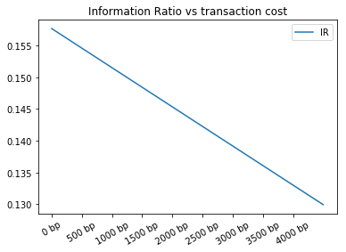


```python
plt.plot('transaction_cost','calmar',data=tc_perf_df)
plt.plot('transaction_cost','calmar_bench',data=tc_perf_df)
plt.title('Calmar Ratio vs transaction cost')
plt.xticks(np.arange(0,90,10),rotation=30)
plt.legend()
```


    <matplotlib.legend.Legend at 0x115a5cbe0>


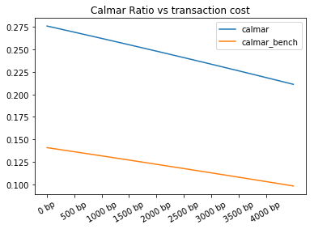


### 5. Data Export

Exporting data to csv


```python
weights_df = pd.DataFrame(w)
weights_df['Dates'] = processed_df['Dates']
weights_df.columns = ['w_stock','w_bond','w_bill','Dates']
weights_df.to_csv('weight.csv')
```


```python

```


```python

```
