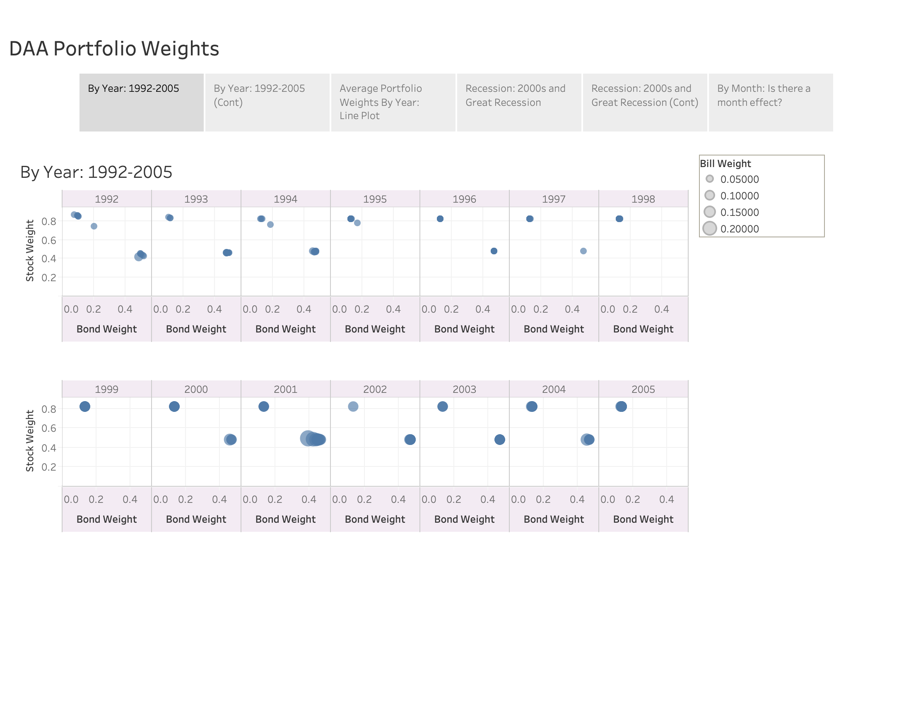
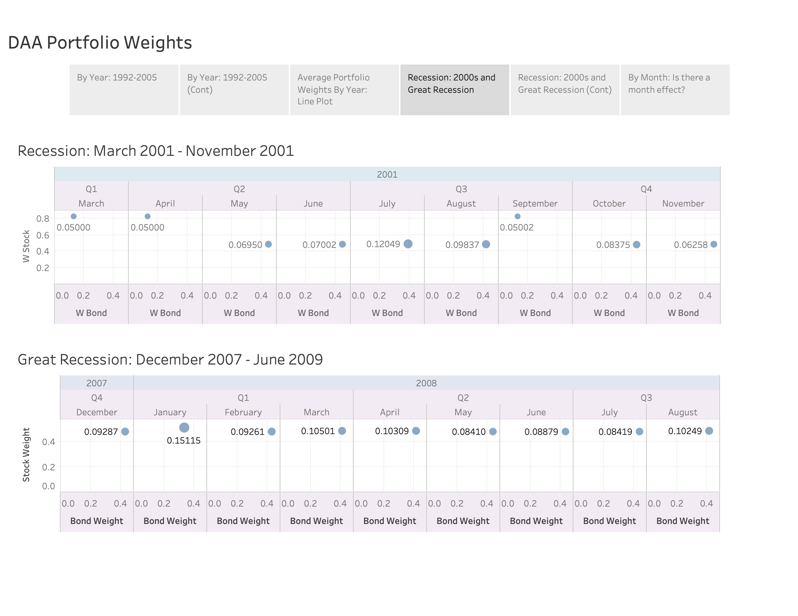
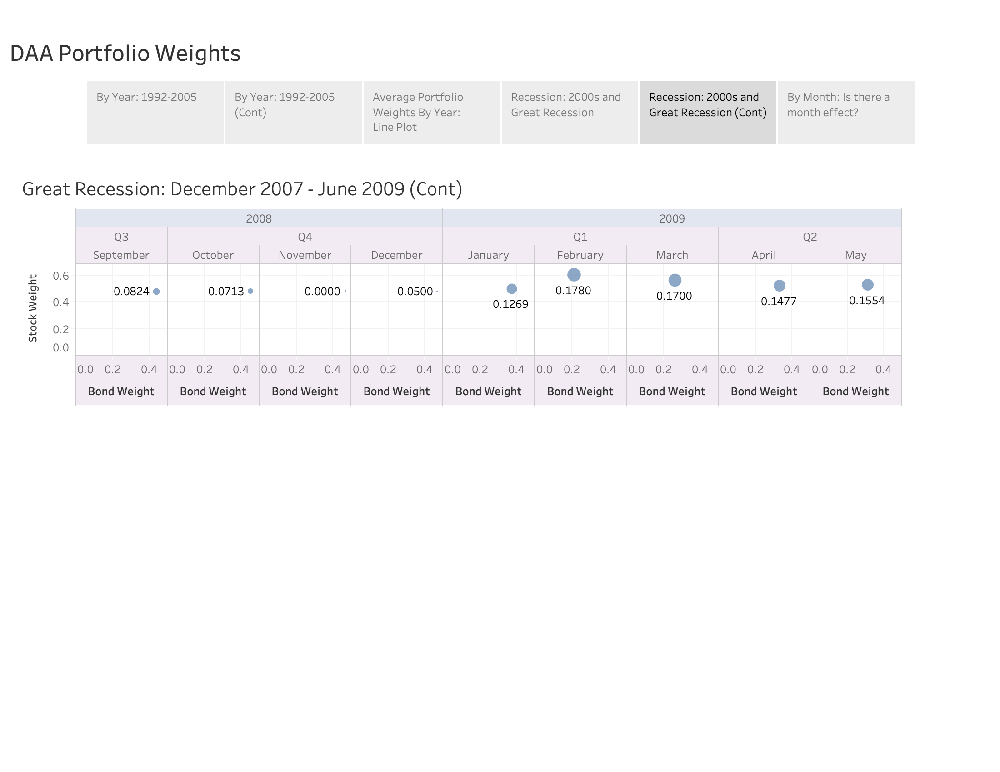

This project attempts to implement the research paper:
### Return Predictability and Dynamic Asset Allocation: How Often Should Investors Rebalance?
#### by _Himanshu Almadi, David E. Rapach, and Anil Suri_

To view the work until now, please find `Implementation_Exercise.ipynb`.

Below are a few visualizations of results

### Monthly DAA Portfolio Weights

Accessible at https://public.tableau.com/profile/donggeun.kim#!/vizhome/Portfolio_Weights/Story1










```python

```
