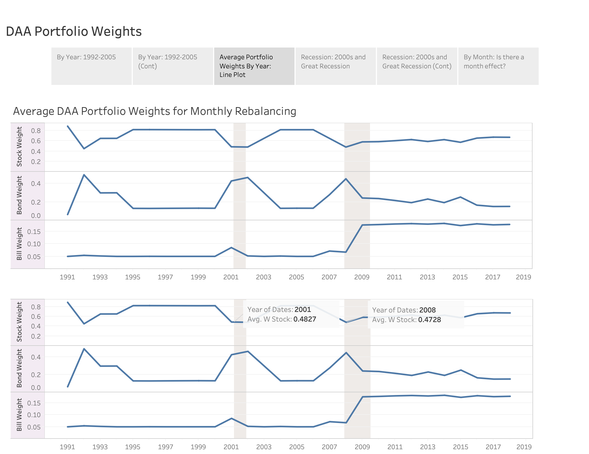

This project attempts to implement the research paper:
### Return Predictability and Dynamic Asset Allocation: How Often Should Investors Rebalance?
#### by _Himanshu Almadi, David E. Rapach, and Anil Suri_

To view the work until now, please find `Implementation_Exercise.ipynb`.
However, the file is too large for smooth viewing at Github.
In this case, please refer to `Implementation_Exercise.md` in `Implementation_Exercise` Folder.
The problem with `Implementation_Exercise.md` is that Markdown Math Equations are not rendered.

I was interested in understanding whether there is a systematic pattern in the estimated portfolio weights from the model. Rmarkdown that utilized ARIMA-GARCH is available at `ARIMA_GARCH on esimated portfolio weights.pdf`. Also, a few Tableau visualizations of the estimated portfolio weights are available at https://public.tableau.com/profile/donggeun.kim#!/vizhome/Portfolio_Weights/Story1.
Screenshot of the Tableau visualizations are as following:

### Updated: Robust Allocation
I compared the robust allocation with the original formulation and it yielded the better performance evaluation results as following:

### Monthly DAA Portfolio Weights

